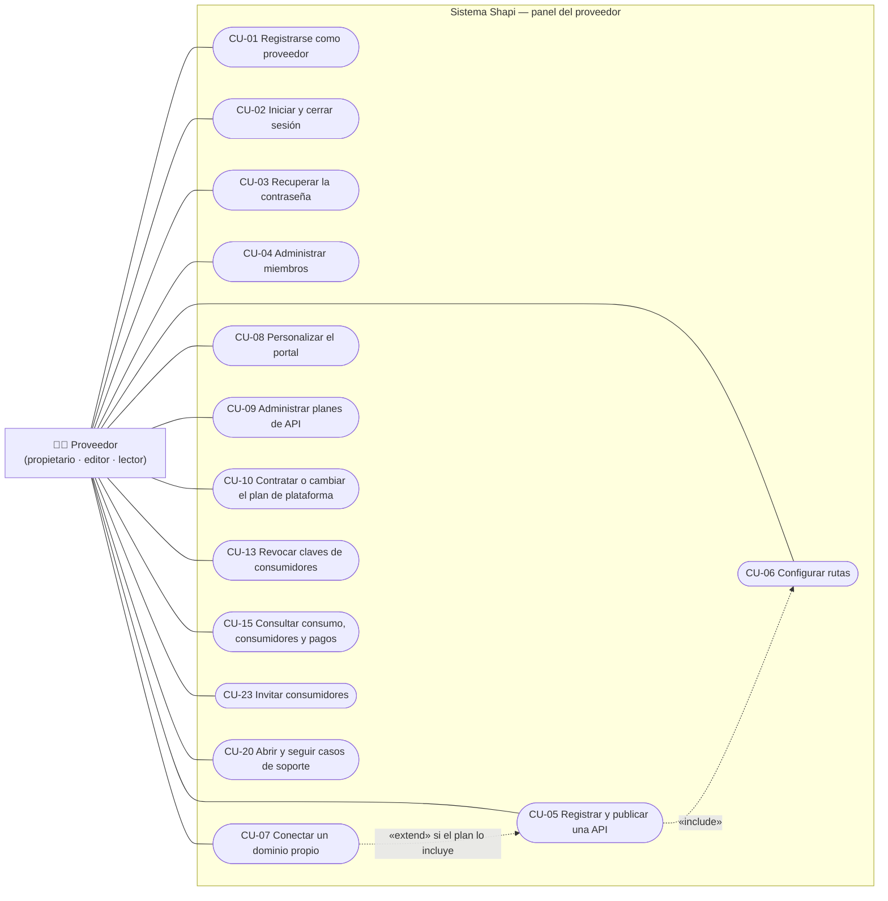
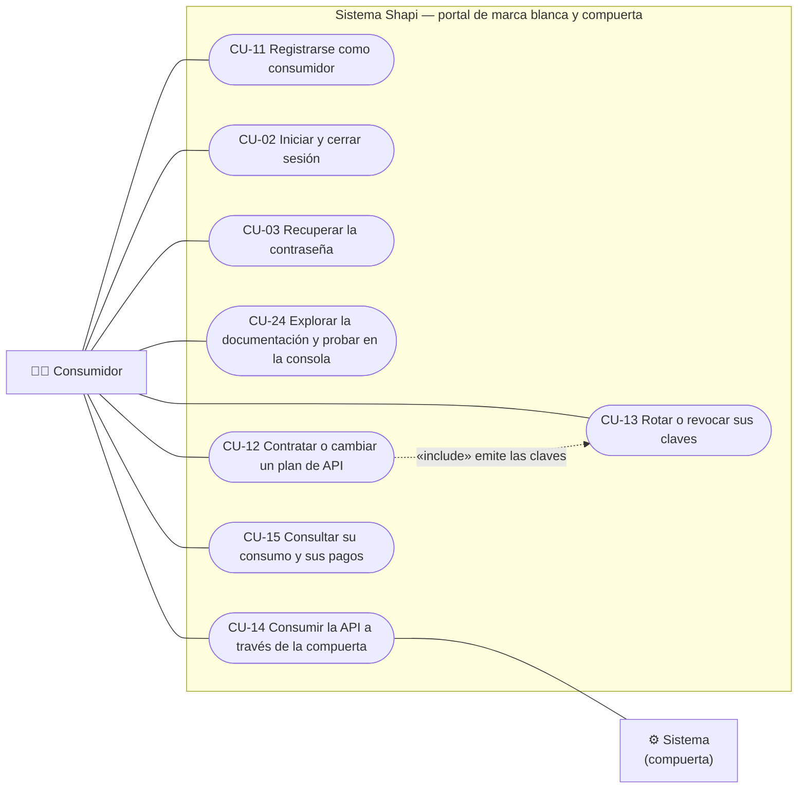
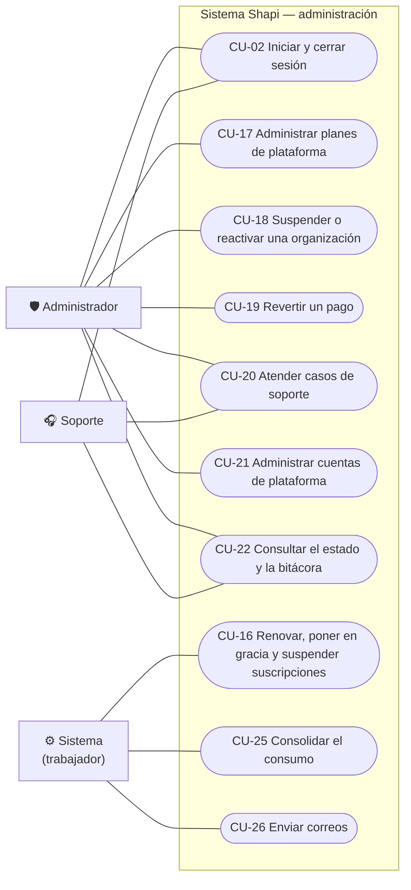

# 05 · Casos de uso

## 1. Diagramas de casos de uso

Hay un diagrama por grupo de actores para que se pueda leer. El caso compartido de autenticación (CU-02 y CU-03) aparece en los tres.

### 1.1 Proveedor

### 1.2 Consumidor

### 1.3 Administrador, soporte y procesos automáticos

## 2. Especificaciones

Formato: **Actor**, **Precondiciones**, **Flujo principal**, **Flujos alternos**, **Postcondiciones**, **Requisitos** y **Pantallas**.

### CU-01 Registrarse como proveedor
- **Actor:** visitante (futuro propietario).
- **Precondiciones:** ninguna.
- **Flujo principal:**
  1. El visitante abre `/registro` y escribe su nombre, correo, nombre de la organización y contraseña.
  2. El sistema valida los datos, crea el usuario, la organización y la membresía de `propietario`, y la suscripción al plan Prueba (activa por 30 días).
  3. El sistema pone en la cola el correo de verificación y muestra el aviso A1.2.
  4. El visitante abre el enlace. El sistema marca el correo como verificado e inicia la sesión.
- **Flujos alternos:**
  - **2a.** El correo ya existe: se muestra "Ya existe una cuenta con ese correo", con enlaces a entrar y a recuperar la contraseña.
  - **4a.** El enlace venció o ya se usó: se ofrece reenviarlo.
- **Postcondiciones:** existe una organización en el plan Prueba, con el correo sin verificar hasta que se completa el paso 4.
- **Requisitos:** RF-01, RF-02 · **Pantallas:** A1.1, A1.2.

### CU-02 Iniciar y cerrar sesión
- **Actor:** personal o consumidor.
- **Precondiciones:** la cuenta existe y está activa.
- **Flujo principal:**
  1. El actor escribe su correo y su contraseña.
  2. El sistema los verifica, crea una sesión y envía la cookie de su ámbito.
  3. El sistema lo enruta: el administrador y el soporte a `/admin`, el proveedor a `/panel/apis` y el consumidor a `/cuenta/suscripcion`, o a la página desde la que llegó.
  4. Al cerrar sesión, la sesión queda revocada.
- **Flujos alternos:**
  - **2a.** Las credenciales no son válidas: se muestra un mensaje genérico. Al quinto intento, la cuenta se bloquea 15 minutos.
  - **2b.** La cuenta está desactivada: se muestra "Cuenta desactivada".
- **Requisitos:** RF-04 · **Pantallas:** A1.3, A5.7, A8.1.

### CU-03 Recuperar la contraseña
- **Actor:** personal o consumidor.
- **Flujo principal:**
  1. El actor escribe su correo.
  2. El sistema responde siempre "Si el correo existe, le enviamos un enlace" y, si la cuenta existe, pone en la cola un enlace que vence a los 60 minutos.
  3. El actor abre el enlace y escribe su contraseña nueva.
  4. El sistema la guarda, marca el enlace como usado, revoca todas las sesiones anteriores e inicia una sesión nueva.
- **Flujos alternos:**
  - **3a.** El enlace venció o ya se usó: se ofrece pedir otro.
- **Requisitos:** RF-03 · **Pantallas:** A1.4a, A1.4b, A5.9, A5.10.

### CU-04 Administrar miembros
- **Actor:** propietario.
- **Flujo principal:**
  1. El propietario escribe el correo y el rol (editor o lector) y envía la invitación.
  2. El sistema valida el límite de miembros ([RF-43](03-requisitos.md#rf-43)), crea el token de invitación (vence a los 7 días) y pone en la cola el correo.
  3. La persona invitada abre el enlace, escribe su nombre y su contraseña, y queda como miembro.
  4. El propietario puede cambiar el rol de un miembro o quitarlo, con confirmación.
- **Flujos alternos:**
  - **2a.** El correo ya pertenece a otra organización: error `correo_en_otra_organizacion`.
  - **2b.** Se llegó al límite del plan: error `limite_del_plan`.
- **Requisitos:** RF-06, RF-43 · **Pantallas:** A4.2, A8.2.

### CU-05 Registrar y publicar una API
- **Actor:** propietario o editor.
- **Precondiciones:** el correo está verificado para publicar (para registrar no hace falta) y no se llegó al límite de APIs.
- **Flujo principal:**
  1. El actor escribe el nombre, la URL de origen y el subdominio.
  2. El sistema valida el formato, la disponibilidad del subdominio y que la URL no apunte a direcciones internas, y **prueba la conexión** con el origen.
  3. El sistema guarda la API en estado `borrador` y genera el secreto de origen (se muestra una vez).
  4. El actor carga la especificación. El sistema extrae las rutas y todas quedan ocultas.
  5. El actor expone rutas, las configura (CU-06), crea al menos un plan (CU-09) y pulsa "Publicar".
  6. El sistema publica la configuración en Redis. El portal y la API empiezan a responder en sus hosts.
- **Flujos alternos:**
  - **2a.** El origen no responde: "No pudimos conectar con su servidor", con el detalle del error. No se guarda nada.
  - **2b.** El subdominio está ocupado o reservado: se piden alternativas.
  - **4a.** La especificación no es válida: se indica el error.
  - **5a.** Falta verificar el correo, no hay ninguna ruta expuesta o no hay ningún plan activo: se indica qué falta.
- **Requisitos:** RF-08 a RF-11, RF-14, RF-43, RF-47 · **Pantallas:** A3.1 a A3.4, A3.6.

### CU-06 Configurar rutas
- **Actor:** propietario o editor.
- **Flujo principal:** el actor define por ruta el límite por minuto, la caché y el peso en llamadas y guarda. El sistema publica los cambios en Redis en menos de 10 segundos.
- **Flujos alternos:** si se configura caché en una ruta que no es GET, el campo se deshabilita.
- **Requisitos:** RF-10, RF-13 · **Pantallas:** A3.4, A3.5.

### CU-07 Conectar un dominio propio
- **Actor:** propietario o editor.
- **Precondiciones:** el plan incluye dominio propio.
- **Flujo principal:**
  1. El actor escribe el dominio.
  2. El sistema muestra el registro CNAME que hay que crear, con destino `{sub}.api.shapi.localhost`.
  3. En el entorno simulado, el actor pulsa "Simular la creación del registro" y el sistema lo inserta en el DNS simulado.
  4. El actor pulsa "Verificar registro DNS". El sistema consulta el resolutor configurado y, si el registro coincide, marca el dominio como `verificado`.
  5. Con la primera petición al dominio, el borde pide autorización a la API de control y emite el certificado.
- **Flujos alternos:**
  - **4a.** El registro no existe o apunta a otro destino: el dominio queda `pendiente`, con el motivo. Si en 72 horas no se verifica, pasa a `fallido`.
- **Requisitos:** RF-12 · **Pantallas:** A3.6.

### CU-08 Personalizar el portal
- **Actor:** propietario o editor.
- **Flujo principal:** el actor sube el logotipo y elige el color, el nombre y el texto de bienvenida. La vista previa se actualiza en vivo. Al guardar, el portal publicado muestra los cambios.
- **Requisitos:** RF-15, RF-16 · **Pantallas:** A3.7.

### CU-09 Administrar planes de API
- **Actor:** propietario o editor.
- **Flujo principal:** el actor crea o edita un plan con nombre, descripción, precio (o lo marca como gratuito), vigencia, cuota de llamadas y límite por minuto. El sistema lo publica en el portal.
- **Flujos alternos:**
  - Si el plan tiene suscripciones, "eliminar" lo desactiva.
  - Los cambios de cuota y de límite se aplican de inmediato; los de precio, en la siguiente renovación.
- **Requisitos:** RF-18 · **Pantallas:** A4.1.

### CU-10 Contratar o cambiar el plan de plataforma
- **Actor:** propietario.
- **Flujo principal:**
  1. El actor elige un plan en A2.1.
  2. Si viene del plan Prueba o de un plan más barato, el sistema calcula el monto a pagar hoy (el precio completo o el prorrateo).
  3. El actor escribe los datos de la tarjeta o usa la que tiene registrada.
  4. La pasarela simulada autoriza el cobro. El sistema registra el pago y activa el plan.
- **Flujos alternos:**
  - **4a.** La pasarela rechaza el cobro: se muestra A2.4 y el plan vigente no cambia.
  - **2a.** El plan elegido es más barato: el cambio se programa para la siguiente renovación, sin cobro. Si la organización excede los límites del plan nuevo, se rechaza con `excede_limites_del_plan`.
- **Requisitos:** RF-19, RF-20, RF-25 · **Pantallas:** A2.1 a A2.5.

### CU-11 Registrarse como consumidor
- **Actor:** visitante del portal.
- **Flujo principal:**
  1. El visitante escribe su nombre, correo, nombre de la empresa y contraseña.
  2. El sistema crea el consumidor dentro de la organización de ese portal y pone en la cola el correo de verificación.
  3. El visitante confirma su correo.
- **Flujos alternos:**
  - **1a.** Llega por invitación: el correo ya viene escrito y la cuenta queda verificada.
  - **2a.** El correo ya existe en esa organización: se ofrecen entrar y recuperar la contraseña.
- **Requisitos:** RF-05, RF-02 · **Pantallas:** A5.3, A5.3b, A5.8.

### CU-12 Contratar o cambiar un plan de API
- **Actor:** consumidor con el correo verificado.
- **Flujo principal:**
  1. El consumidor elige un plan en A5.4.
  2. Si el plan es de pago, escribe los datos de la tarjeta (A5.6) y la pasarela autoriza el cobro.
  3. El sistema crea la suscripción y emite las claves de producción y de pruebas.
  4. El sistema publica en Redis las claves (su hash) y la suscripción.
  5. El portal muestra las dos claves completas **una sola vez** (A5.4b).
- **Flujos alternos:**
  - **2a.** La tarjeta es rechazada: el mismo formulario muestra el error y no se crea nada.
  - **1a.** El consumidor ya tiene una suscripción en esa API: el flujo pasa a ser un cambio de plan (B2.7), con las reglas de [RF-25](03-requisitos.md#rf-25).
- **Requisitos:** RF-19, RF-20, RF-25, RF-26 · **Pantallas:** A5.4, A5.6, A5.4b, B2.7.

### CU-13 Gestionar claves
- **Actores:** consumidor (rotar y revocar las suyas) y proveedor (revocar las de sus consumidores).
- **Flujo principal (rotar):**
  1. El consumidor pulsa "Rotar" en una clave activa y confirma (B2.4).
  2. El sistema emite una clave nueva, pone la anterior en estado `rotada` con 24 horas más de vigencia y actualiza Redis.
  3. La clave nueva se muestra una sola vez (B2.5).
- **Flujo principal (revocar):**
  1. El actor pulsa "Revocar" y confirma (A4.3b o B2.6).
  2. El sistema marca la clave como `revocada`, la elimina de Redis y, si la revocó el proveedor, lo registra en la bitácora.
  3. A partir de ese momento, la compuerta responde 401.
- **Flujos alternos:** si la clave está revocada, el consumidor puede pulsar "Emitir una clave nueva", que se muestra una sola vez.
- **Requisitos:** RF-26, RF-27, RF-28 · **Pantallas:** A4.3, A4.3b, B2.3 a B2.6.

### CU-14 Consumir la API a través de la compuerta
- **Actor:** consumidor (su sistema) y la compuerta.
- **Flujo principal:** la petición atraviesa la tubería de filtros de [08 §3](08-compuerta.md#3-tuberia-de-filtros), llega al origen y la respuesta vuelve con las cabeceras de cuota.
- **Flujos alternos:** los rechazos 401, 403, 404 y 429, y los errores 502 y 504, que se describen en [08 §4](08-compuerta.md#4-contrato-de-errores).
- **Requisitos:** RF-29 a RF-33, RF-45 · **Pantallas:** —.

### CU-15 Consultar consumo, consumidores y pagos
- **Actores:** proveedor y consumidor.
- **Flujo principal:** el actor elige el periodo o la API, y el sistema muestra las métricas consolidadas y el historial de pagos.
- **Requisitos:** RF-21, RF-35, RF-36, RF-37 · **Pantallas:** B1.1 a B1.3, B2.1, B2.2.

### CU-16 Renovar, poner en gracia y suspender suscripciones
- **Actor:** sistema (trabajador), cada minuto.
- **Flujo principal:**
  1. El trabajador toma las suscripciones con `fin <= ahora` en estado `activa`.
  2. Si la suscripción tiene un `plan_siguiente_id`, lo aplica.
  3. Si el plan es gratuito, abre un ciclo nuevo sin cobrar. Si es de pago, cobra al medio de pago registrado.
  4. Si el cobro se autoriza, abre un ciclo nuevo, reinicia la cuota y actualiza Redis.
- **Flujos alternos:**
  - **3a.** El cobro se rechaza o no hay medio de pago: la suscripción pasa a `en_gracia`, con `gracia_hasta = fin + 7 días`, y se pone en la cola el correo.
  - **3b.** El plan es Prueba: pasa directamente a `en_gracia` y se avisa por correo.
  - **5.** Cuando llega `gracia_hasta` sin pago, la suscripción pasa a `suspendida`, Redis se actualiza (la compuerta responde 403) y se pone en la cola el correo.
- **Requisitos:** RF-22, RF-23, RF-44, RF-46 · **Pantallas:** B1.4, B2.3.

### CU-17 Administrar planes de plataforma
- **Actor:** administrador. Crea, edita y desactiva planes ([RF-17](03-requisitos.md#rf-17)). · **Pantallas:** A6.1.

### CU-18 Suspender o reactivar una organización
- **Actor:** administrador.
- **Flujo principal:**
  1. El administrador confirma la suspensión (A6.2b).
  2. El sistema pone `estado_admin = suspendida`, actualiza Redis, registra la acción en la bitácora y avisa al propietario.
  3. La compuerta responde 403 en menos de 10 segundos.
  4. Reactivar la organización revierte todo lo anterior.
- **Requisitos:** RF-38, RF-41 · **Pantallas:** A6.2, A6.2b.

### CU-19 Revertir un pago
- **Actor:** administrador.
- **Flujo principal:** el administrador confirma (A6.3b). La pasarela simulada devuelve el monto, el pago pasa a `revertido` y, si cubría el ciclo vigente, la suscripción entra en gracia. Queda en la bitácora.
- **Requisitos:** RF-24, RF-41 · **Pantallas:** A6.3, A6.3b.

### CU-20 Atender casos de soporte
- **Actores:** proveedor, soporte y administrador.
- **Flujo principal:**
  1. El proveedor abre un caso con un asunto, una descripción y, opcionalmente, la API afectada (A7.1).
  2. El soporte lo ve en A6.4, se lo asigna y consulta los datos de la organización en solo lectura.
  3. El soporte responde; el proveedor recibe un correo y ve la respuesta en A7.2.
  4. Cualquiera de las dos partes responde hasta que el soporte cierra el caso.
- **Flujos alternos:**
  - **1a.** El soporte registra el caso a nombre de la organización, por ejemplo después de una llamada.
- **Requisitos:** RF-40, RF-46 · **Pantallas:** A7.1, A7.2, A6.4, A6.4b.

### CU-21 Administrar cuentas de plataforma
- **Actor:** administrador. Crea cuentas de administración o de soporte (reciben un enlace para definir su contraseña) y las desactiva o reactiva ([RF-42](03-requisitos.md#rf-42)). · **Pantallas:** A6.5.

### CU-22 Consultar el estado y la bitácora
- **Actores:** administrador y soporte. Ven el estado de los componentes con la latencia p95 de la compuerta, y la bitácora filtrada por fechas ([RF-39](03-requisitos.md#rf-39), [RF-41](03-requisitos.md#rf-41)). · **Pantallas:** B3.1, B3.2.

### CU-23 Invitar consumidores
- **Actor:** propietario o editor.
- **Flujo principal:** el actor escribe el correo del consumidor y envía la invitación (vence a los 7 días). La lista muestra las invitaciones pendientes, que se pueden cancelar o reenviar.
- **Requisitos:** RF-05 · **Pantallas:** B1.5.

### CU-24 Explorar la documentación y probar en la consola
- **Actor:** visitante o consumidor.
- **Flujo principal:** el actor navega por las rutas expuestas, pega su clave de pruebas en la consola, completa los parámetros y envía la petición. La respuesta real se muestra con su código.
- **Requisitos:** RF-16, RF-45 · **Pantallas:** A5.0, A5.1, A5.2.

### CU-25 Consolidar el consumo
- **Actor:** sistema (trabajador), cada 10 segundos. Sigue el algoritmo idempotente de [08 §7](08-compuerta.md#7-medicion-y-consolidacion) ([RF-34](03-requisitos.md#rf-34)).

### CU-26 Enviar correos
- **Actor:** sistema (trabajador), cada 5 segundos. Toma los correos `pendiente` de `correo_saliente`, los envía por SMTP (a Mailpit en el entorno simulado) y los reintenta hasta 5 veces, con espera exponencial ([RF-46](03-requisitos.md#rf-46)).
