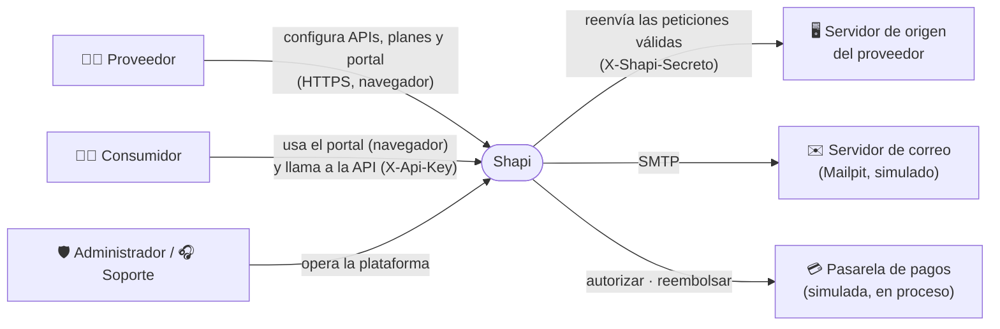
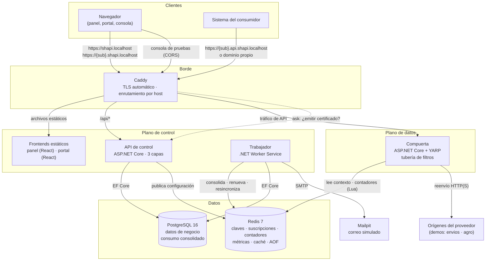
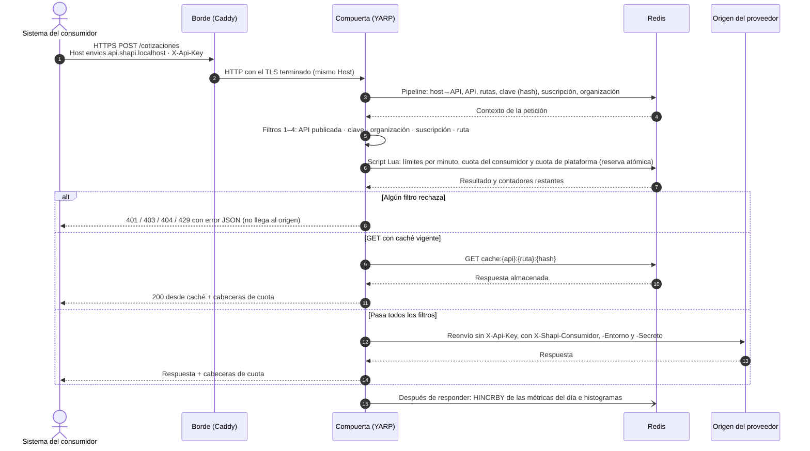
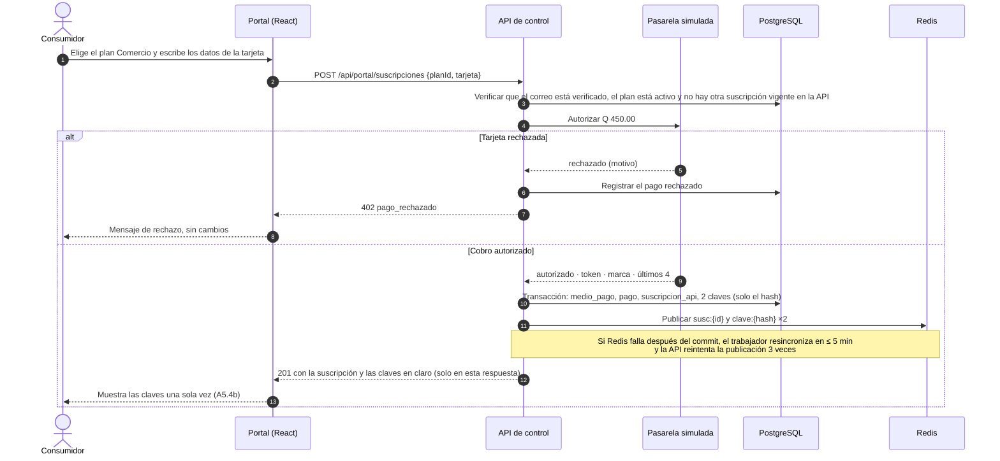
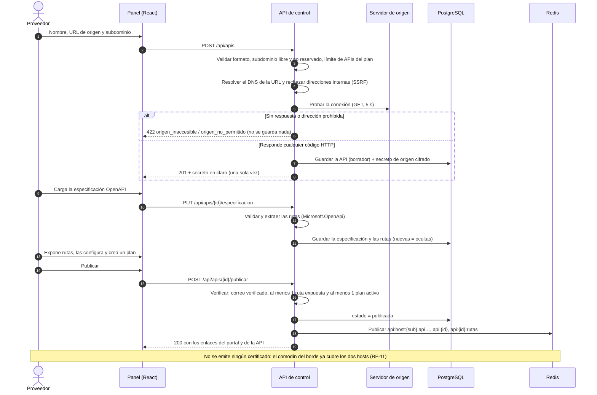
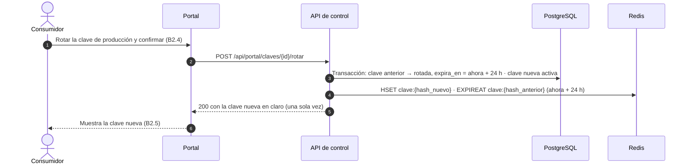
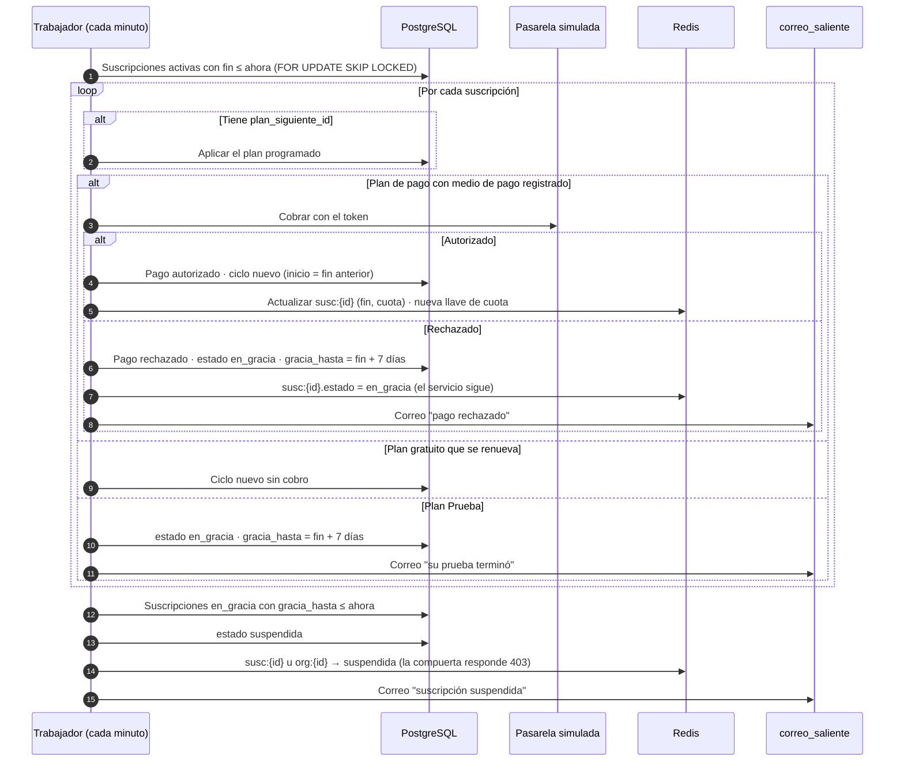
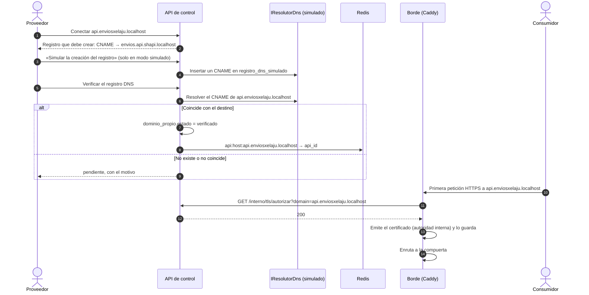
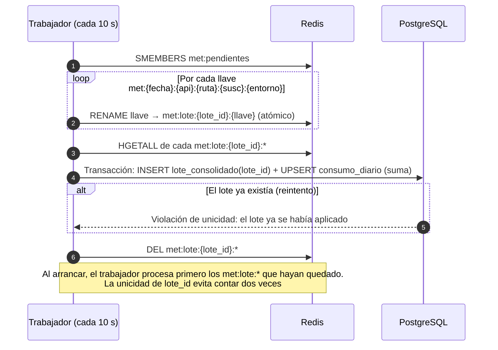
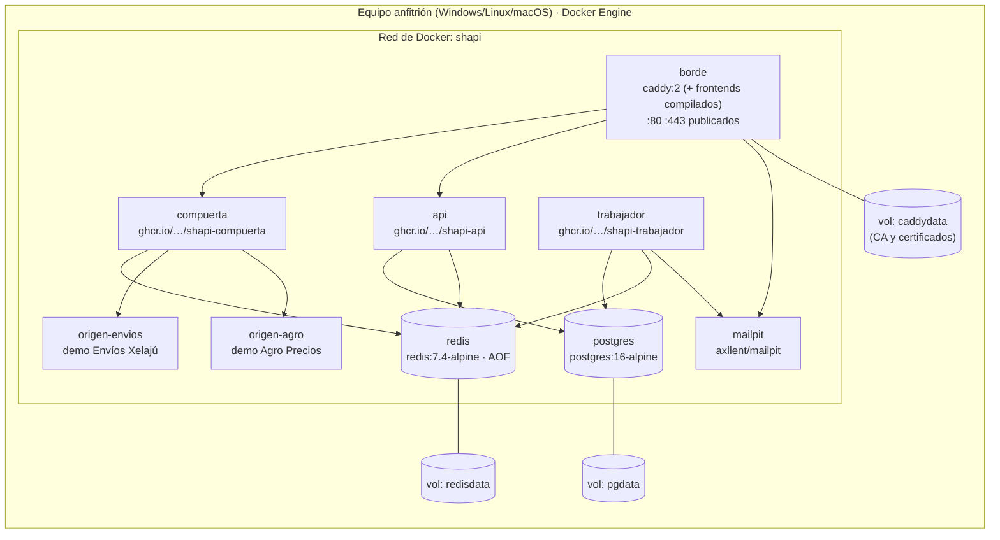

# 06 · Arquitectura

## 1. Estilo arquitectónico y justificación

La solución separa el **plano de control** del **plano de datos**. Se despliegan como procesos independientes y solo comparten PostgreSQL y Redis. Cada plano usa una arquitectura distinta porque sus atributos de calidad son distintos:

| Plano | Qué prioriza | Estilo | Por qué |
|---|---|---|---|
| **Datos** (la compuerta) | Latencia de 15 ms o menos en el p95, disponibilidad y extensibilidad de las reglas | **Tuberías y filtros** | Cada regla es un filtro independiente que deja pasar la petición o la detiene. Una regla nueva es un filtro más ([RNF-13](03-requisitos.md#rnf-13)). No consulta PostgreSQL, solo Redis ([RNF-02](03-requisitos.md#rnf-02)). |
| **Control** (API de control y trabajador) | Correctitud, trazabilidad y reglas de negocio | **Tres capas**: presentación, lógica de negocio y acceso a datos | Separa la API HTTP de las reglas del dominio y de la persistencia, para poder probar las reglas sin infraestructura. |

**Alternativas que se descartaron** (el detalle está en [12 · ADR-27](12-decisiones.md)):

- **Un monolito**: si la compuerta viviera en el mismo proceso que el panel, una caída o un despliegue del panel detendría el tráfico de los clientes (incumple [RNF-04](03-requisitos.md#rnf-04)).
- **Microservicios por dominio**: para 4 personas y 6 semanas, cuestan más en operación de lo que aportan.
- **Una compuerta existente** (Kong, Tyk): el curso pide desarrollo *full stack* y la compuerta es el núcleo del producto. Con YARP se programa en C# y se reutiliza el modelo de dominio.

## 2. Diagrama de contexto



## 3. Contenedores y procesos



| Proceso | Tecnología | Responsabilidad | Si se cae |
|---|---|---|---|
| **Borde** | Caddy 2 | Termina TLS, emite certificados automáticamente (con la autoridad interna y *on-demand*), redirige HTTP a HTTPS, enruta por host y sirve los frontends | Se cae todo el sistema; es el único punto de entrada |
| **Compuerta** | .NET 10 + YARP | Tubería de filtros, reenvío al origen, cabeceras y métricas | Se detiene el tráfico de las APIs. El panel sigue funcionando |
| **API de control** | .NET 10, ASP.NET Core | API REST del panel, del portal y de administración; reglas de negocio; publica la configuración en Redis | No se puede administrar nada, pero **el tráfico sigue** ([RNF-04](03-requisitos.md#rnf-04)) |
| **Trabajador** | .NET 10 Worker | Consolida métricas cada 10 s, cierra ciclos cada minuto, envía correos cada 5 s, verifica dominios pendientes cada 5 min y resincroniza Redis cada 5 min | Se pausan la consolidación y las renovaciones, **sin perder datos** ([RNF-05](03-requisitos.md#rnf-05)) |
| **Frontends** | React 19 + TypeScript + Vite | `panel`: sitio público, panel del proveedor y administración. `portal`: portal de marca blanca, que identifica la API por el host | — |
| **Redis** | Redis 7.4, AOF `everysec` | Vista de lectura de la compuerta, contadores atómicos, métricas pendientes y caché de respuestas | Se detiene la compuerta. Al volver, el trabajador reconstruye la caché desde PostgreSQL |
| **PostgreSQL** | PostgreSQL 16 | Fuente de verdad de los datos de negocio | Se detiene la administración; **la compuerta sigue funcionando** |
| **Mailpit** | Mailpit | Servidor SMTP y bandeja web de correo simulado | Los correos esperan en `correo_saliente` y B3 marca el correo como degradado |

## 4. Hosts y enrutamiento en el borde

El dominio base se configura con `SHAPI_DOMINIO_BASE` y vale `shapi.localhost` en todos los ambientes, porque se usan dominios simulados ([ADR-09](12-decisiones.md)).

| Host | Destino | Contenido |
|---|---|---|
| `shapi.localhost` | Frontend `panel` (estático) + `/api/*` → API de control | Sitio público (`/`, `/registro`, `/entrar`, …), panel del proveedor (`/panel/*`) y administración (`/admin/*`) |
| `{sub}.shapi.localhost` | Frontend `portal` (estático) + `/api/portal/*` → API de control | Portal de marca blanca de la API con ese subdominio |
| `{sub}.api.shapi.localhost` | Compuerta | Tráfico de la API |
| Dominio propio verificado, por ejemplo `api.enviosxelaju.localhost` | Compuerta | Tráfico de la API. El certificado se emite *on-demand* |
| `correo.shapi.localhost` | Mailpit (puerto 8025) | Bandeja de correo simulado. Solo existe en los ambientes de desarrollo y de demostración |

**Subdominios reservados**, que no se pueden usar como `{sub}`: `api`, `app`, `www`, `admin`, `panel`, `correo`, `mail`, `soporte`, `docs`, `estado`, `status`, `shapi`, `static`, `cdn`, `interno`.

La API de control expone además `/interno/*`, que **solo es accesible desde la red de Docker** porque Caddy no lo publica:
- `GET /interno/tls/autorizar?domain=…`: el *ask* de *on-demand TLS*. Responde 200 si el dominio es propio y está verificado, y 404 en cualquier otro caso.
- `GET /interno/salud`.

La **consola de pruebas** llama desde `https://{sub}.shapi.localhost` a `https://{sub}.api.shapi.localhost`, así que la compuerta responde el *preflight* CORS **sin pedir clave**, y solo permite como origen el host del portal de esa API ([08 §6](08-compuerta.md#6-cors)).

## 5. Diagramas de secuencia

### 5.1 Procesamiento de una petición en la compuerta



### 5.2 Contratación de un plan de API



### 5.3 Publicación de una API



### 5.4 Rotación de una clave



### 5.5 Cierre de ciclo, renovación, gracia y suspensión



### 5.6 Verificación de un dominio propio y emisión del certificado



### 5.7 Consolidación del consumo



## 6. Dominios simulados

El proyecto tiene presupuesto Q 0.00 ([ADR-09](12-decisiones.md)), así que:

1. **Resolución de nombres:** los navegadores actuales (Chrome, Edge y Firefox) resuelven cualquier `*.localhost` a `127.0.0.1` sin configurar nada (RFC 6761). Por eso todos los hosts de la plataforma cuelgan de `shapi.localhost`.
2. **Certificados:** Caddy usa su **autoridad certificadora interna** (`local_certs`). Emite al instante los comodines `*.shapi.localhost` y `*.api.shapi.localhost`, y los certificados *on-demand* de los dominios propios, y los renueva solo. Cada equipo instala una vez la raíz de Caddy como confiable (`docker compose exec borde caddy trust`, o importando `root.crt`); el manual técnico (`docs/manual-tecnico.md`, se escribe durante el desarrollo) explica cómo.
3. **Dominios propios:** en el entorno simulado deben terminar en `.localhost` (por ejemplo `api.enviosxelaju.localhost`) para que resuelvan al equipo local. La verificación usa `IResolutorDns`:
   - `SHAPI_DNS_MODO=simulado`, el valor por defecto: consulta la tabla `registro_dns_simulado`. El botón "Simular la creación del registro" de A3.6 inserta el CNAME, haciendo el papel del proveedor de DNS del cliente.
   - `SHAPI_DNS_MODO=real`: consulta el DNS público con DnsClient.NET. Queda disponible por si algún día hay un dominio real.
4. **Correo:** Mailpit hace de servidor SMTP y de bandeja web (`https://correo.shapi.localhost`). Si se quiere usar un servidor SMTP real, basta con configurar las variables `SHAPI_SMTP_*`.
5. **Clientes fuera del navegador:** las versiones actuales de `curl` también resuelven `*.localhost` a loopback. Para otros clientes se puede usar `curl --resolve` o una entrada en el archivo `hosts`.

## 7. Despliegue

### 7.1 Ambientes

| Ambiente | Cómo se levanta | Diferencias |
|---|---|---|
| **Desarrollo** | `docker compose up` con los servicios de infraestructura, y los proyectos .NET y Vite corriendo en el equipo con recarga en caliente | `SHAPI_MODO_DEMO=true`, registros detallados y siembra de demostración |
| **Productivo simulado** (el que se presenta) | `docker compose -f compose.yml -f compose.prod.yml up -d`, con **imágenes publicadas en GHCR** por la integración continua | Compilación *Release*, frontends minificados, `ASPNETCORE_ENVIRONMENT=Production`, variables desde `.env`, volúmenes persistentes, reinicio automático, verificaciones de salud y sin puertos internos expuestos. `SHAPI_MODO_DEMO=true` solo para la exposición |
| **Pruebas (CI)** | GitHub Actions, con Testcontainers para PostgreSQL y Redis | Se ejecuta en cada *pull request* |

El "ambiente productivo" que piden los lineamientos se cumple con el **mismo stack**, contenedores versionados, configuración externa, TLS, persistencia y verificaciones de salud. Como el presupuesto es cero, corre en un equipo del equipo de trabajo el día de la exposición, y no en un servidor público.

### 7.2 Diagrama de despliegue



Los orígenes de demostración (`origen-envios` y `origen-agro`) son dos APIs mínimas con su especificación OpenAPI y los datos de los mockups. Sirven para demostrar el sistema de punta a punta ([ADR-33](12-decisiones.md)). En la siembra, sus URL de origen son `http://origen-envios:8080` y `http://origen-agro:8080`, que están en la red de Docker. Por eso la **lista de redes permitidas** de la protección contra SSRF incluye esos dos nombres de servicio **solo** cuando `SHAPI_MODO_DEMO=true`.

### 7.3 Integración continua

- En cada *pull request*: compilar, ejecutar las pruebas del backend (xUnit con Testcontainers) y del frontend (Vitest), revisar formato y *lint*, y hacer un *build* de las imágenes.
- En cada *merge* a `main`: publicar las imágenes `shapi-api`, `shapi-compuerta`, `shapi-trabajador` y `shapi-borde` en GHCR, que es gratis para repositorios públicos.
- Antes de la exposición: pruebas de extremo a extremo con Playwright contra el ambiente productivo simulado.

## 8. Observabilidad y estado de componentes

- Cada proceso .NET expone `/salud`, con verificaciones de salud de ASP.NET Core, y escribe registros estructurados en JSON en la salida estándar.
- La compuerta y el trabajador escriben cada 10 segundos un **latido** en Redis (`salud:compuerta:{instancia}` y `salud:trabajador`, con un TTL de 30 s).
- La API de control calcula el estado de B3.1 cada 30 segundos:

| Componente | En servicio | Degradado | Fuera de servicio |
|---|---|---|---|
| Compuerta de APIs | Latido vigente y p95 de la última hora ≤ 15 ms | Latido vigente y p95 > 15 ms | Sin latido |
| API de control | Siempre, si puede responder | Tarda más de 1 s en responder `/salud` | — (si está caída, B3 no carga) |
| Trabajador en segundo plano | Latido vigente y la consolidación va al día (atraso < 60 s) | Atraso de la consolidación ≥ 60 s | Sin latido |
| Caché (Redis) | `PING` < 50 ms | `PING` ≥ 50 ms | No responde |
| Base de datos (PostgreSQL) | Consulta de prueba < 200 ms | ≥ 200 ms | No responde |
| Pasarela de pagos simulada | Siempre | — | Si `SHAPI_PASARELA_FALLA=true` (para demostraciones) |
| Envío de correo | No hay correos pendientes con más de 2 minutos | Hay correos pendientes con más de 2 minutos o fallos recientes | El servidor SMTP no responde |

## 9. Estructura del repositorio

```
shapi/
├─ docs/
│  ├─ specs/            ← estas especificaciones (fuente de verdad)
│  ├─ lineamientos.md   ← reglas oficiales del curso
│  ├─ plan/             ← plan de desarrollo: guía, instalación, protocolo, convenciones, calendario, tareas y bitácoras
│  ├─ pdf/              ← documentos entregables generados en PDF
│  ├─ manual-tecnico.md
│  └─ manual-usuario.md
├─ mockups/             ← diseños aprobados (ver 11 · Interfaz)
├─ contratos/openapi/   ← contratos HTTP de la API de control, uno por módulo
├─ scripts/             ← tareas.mjs, verificar-entorno.mjs, generar-pdf.mjs
├─ AGENTS.md            ← instrucciones para cualquier agente de IA (CLAUDE.md lo importa)
├─ src/
│  ├─ Shapi.Dominio/          ← capa de lógica: entidades, reglas y máquinas de estado (sin dependencias)
│  ├─ Shapi.Aplicacion/       ← capa de lógica: casos de uso e interfaces (IPasarelaPagos, IResolutorDns, IReloj, IColaCorreo, IPublicadorCache)
│  ├─ Shapi.Infraestructura/  ← capa de datos: EF Core (Npgsql), migraciones, Redis, pasarela simulada, SMTP, DNS
│  ├─ Shapi.Api/              ← capa de presentación: API REST (panel, portal, administración, interno)
│  ├─ Shapi.Contratos/        ← compartido: formato de las llaves de Redis, códigos de error, DTO de la caché
│  ├─ Shapi.Compuerta/        ← plano de datos: YARP + filtros (depende solo de Contratos y de StackExchange.Redis)
│  └─ Shapi.Trabajador/       ← procesos en segundo plano
├─ tests/
│  ├─ Shapi.Dominio.Tests/
│  ├─ Shapi.Api.Tests/        ← integración con Testcontainers, incluido el aislamiento entre organizaciones
│  ├─ Shapi.Compuerta.Tests/  ← un conjunto de pruebas por filtro, más la tubería completa
│  └─ e2e/                    ← Playwright
├─ frontend/                  ← pnpm workspace
│  ├─ apps/panel/             ← sitio público, panel y administración
│  ├─ apps/portal/            ← portal de marca blanca
│  └─ packages/ui/            ← componentes y tokens de diseño (variante 4)
├─ origenes-demo/
│  ├─ envios-xelaju/
│  └─ agro-precios/
├─ infra/
│  ├─ caddy/Caddyfile
│  ├─ compose.yml
│  └─ compose.prod.yml
└─ .github/workflows/
```

### Stack definitivo

| Capa | Tecnología |
|---|---|
| Backend | .NET 10 (LTS), ASP.NET Core Minimal APIs, YARP 2, EF Core 10 + Npgsql, StackExchange.Redis, Microsoft.OpenApi, DnsClient.NET, MailKit, FluentValidation |
| Frontend | React 19, TypeScript, Vite, React Router, TanStack Query, Tailwind CSS 4 con los tokens de la variante 4, Recharts |
| Datos | PostgreSQL 16, Redis 7.4 |
| Borde | Caddy 2 |
| Pruebas | xUnit, Testcontainers, FluentAssertions, Vitest, Testing Library, Playwright, k6 (carga, para RNF-01 y RNF-03) |
| Infraestructura | Docker Compose, GitHub Actions, GHCR |

### Justificación de cada tecnología

| Tecnología | Por qué se eligió | Dónde se usa |
|---|---|---|
| .NET 10 con ASP.NET Core | Todo el backend queda en un solo lenguaje (C#). Trae de fábrica inyección de dependencias, autenticación, limitación de peticiones y servicios en segundo plano | API de control, compuerta y trabajador |
| YARP | Biblioteca de Microsoft para construir proxies inversos sobre ASP.NET Core. Resuelve el reenvío al origen, la transformación de cabeceras y el cambio de rutas sin reiniciar. Sobre ella se monta la tubería de filtros | Compuerta |
| Entity Framework Core + Npgsql | Traduce las clases del dominio a tablas, maneja las migraciones y aplica el filtro global por organización (RNF-08) | Capa de acceso a datos |
| PostgreSQL 16 | Relacional, transaccional y gratuito. Tiene `NULLS NOT DISTINCT`, arreglos para los histogramas y `jsonb` | Fuente de verdad de los datos de negocio |
| Redis 7.4 | Guarda los datos en memoria y ofrece operaciones atómicas y scripts Lua para contar sin condiciones de carrera. Persiste con AOF | Vista de lectura de la compuerta, contadores, métricas y caché |
| React 19 + Vite + Tailwind | Componentes reutilizables para el panel y el portal. La marca de cada portal se aplica con variables CSS | Frontends `panel` y `portal` |
| Caddy 2 | HTTPS automático con autoridad interna y certificados *on-demand* para los dominios propios, sin clientes ACME ni scripts ([ADR-09](12-decisiones.md)) | Borde |
| OpenAPI (Microsoft.OpenApi) | Estándar para describir APIs. De él se extraen las rutas, la documentación del portal y los campos de la consola | API de control |
| Mailpit | Servidor SMTP con bandeja web, gratuito. Simula el correo sin depender de terceros | Correo simulado |
| Docker Compose | Levanta todo el sistema con un solo comando e idéntico en cualquier equipo (RNF-14) | Desarrollo y ambiente productivo simulado |
| Git, GitHub, Actions y GHCR | Control de versiones, revisión por *pull request*, integración continua y registro de imágenes, gratis en repositorios públicos | Trabajo del equipo y despliegue |
