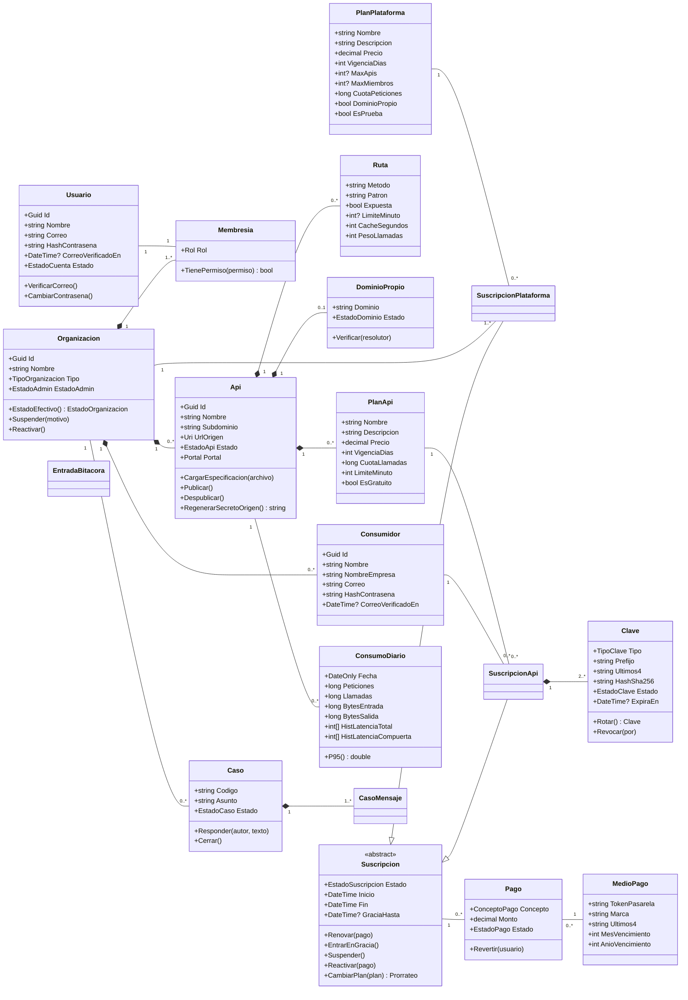
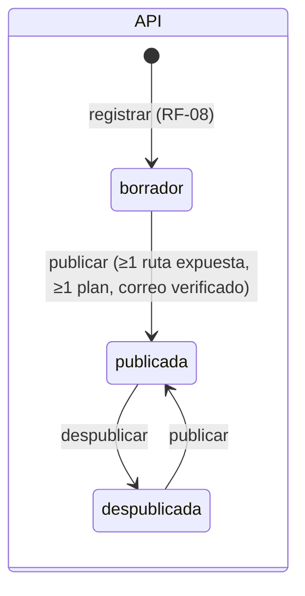
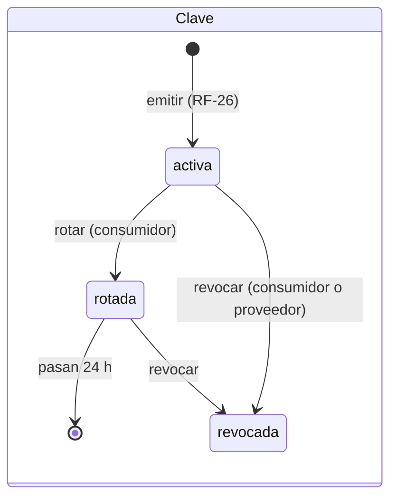
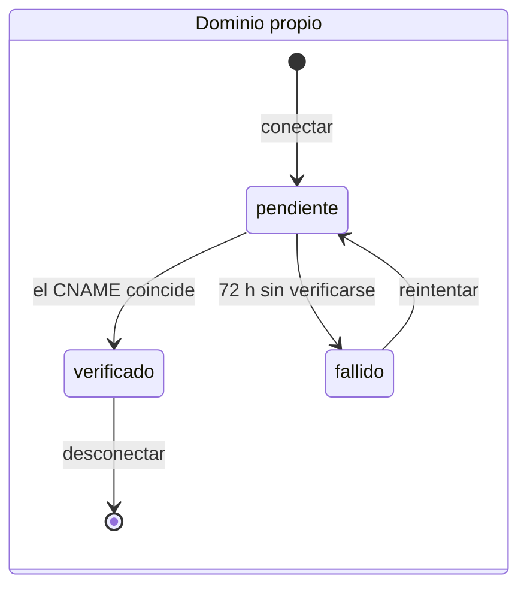
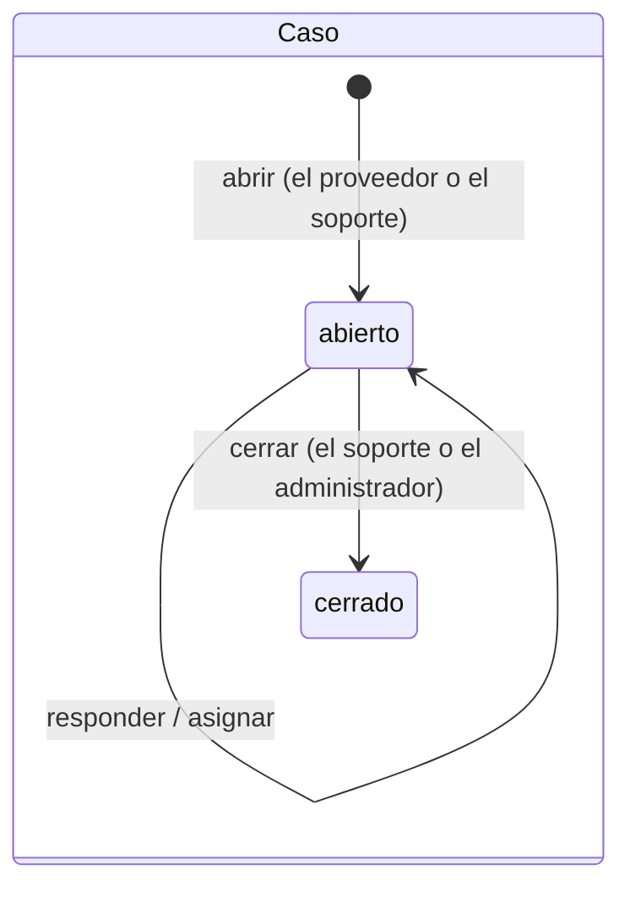

# 07 · Modelo de datos

El modelo se apoya en cinco decisiones:

1. Hay **dos ámbitos de identidad**: `usuario` para el personal y `consumidor` para los clientes de cada proveedor, este último aislado por organización ([ADR-03](12-decisiones.md)).
2. Hay **dos jerarquías de suscripción** independientes: la del proveedor con la plataforma y la del consumidor con una API. Las dos usan la misma máquina de estados.
3. El **subdominio, el portal y la marca son de cada API** ([ADR-07](12-decisiones.md)).
4. El consumo se guarda **ya consolidado por día**, con histogramas de latencia; nunca hay una fila por petición ([ADR-23](12-decisiones.md)).
5. Las claves y los tokens se guardan **con hash**. El secreto de origen se guarda **cifrado**. De las tarjetas solo se guarda el **token** que entrega la pasarela.

## 1. Diagrama de clases del dominio

## 2. Modelo entidad-relación

```mermaid
erDiagram
  ORGANIZACION ||--|{ MEMBRESIA : "tiene"
  USUARIO ||--|| MEMBRESIA : "pertenece por"
  ORGANIZACION ||--o{ CONSUMIDOR : "da de alta"
  ORGANIZACION ||--o{ API : "publica"
  ORGANIZACION ||--|{ SUSCRIPCION_PLATAFORMA : "contrata"
  PLAN_PLATAFORMA ||--o{ SUSCRIPCION_PLATAFORMA : "rige"
  API ||--o{ RUTA : "expone"
  API ||--o| DOMINIO_PROPIO : "conecta"
  API ||--o{ PLAN_API : "ofrece"
  CONSUMIDOR ||--o{ SUSCRIPCION_API : "contrata"
  PLAN_API ||--o{ SUSCRIPCION_API : "rige"
  SUSCRIPCION_API ||--|{ CLAVE : "emite"
  SUSCRIPCION_PLATAFORMA ||--o{ PAGO : "genera"
  SUSCRIPCION_API ||--o{ PAGO : "genera"
  MEDIO_PAGO ||--o{ PAGO : "se usa en"
  ORGANIZACION ||--o{ MEDIO_PAGO : "registra"
  CONSUMIDOR ||--o{ MEDIO_PAGO : "registra"
  API ||--o{ CONSUMO_DIARIO : "acumula"
  RUTA |o--o{ CONSUMO_DIARIO : "desglosa"
  SUSCRIPCION_API |o--o{ CONSUMO_DIARIO : "desglosa"
  ORGANIZACION ||--o{ CASO : "abre"
  CASO ||--|{ CASO_MENSAJE : "contiene"
  USUARIO ||--o{ CASO_MENSAJE : "escribe"
  USUARIO ||--o{ SESION : "abre"
  CONSUMIDOR ||--o{ SESION : "abre"
  USUARIO ||--o{ TOKEN : "recibe"
  CONSUMIDOR ||--o{ TOKEN : "recibe"
  ORGANIZACION ||--o{ BITACORA : "registra"

  ORGANIZACION {
    uuid id PK
    text nombre
    text tipo "plataforma | proveedor"
    text estado_admin "activa | suspendida"
    text motivo_suspension
    timestamptz creado_en
  }
  USUARIO {
    uuid id PK
    text nombre
    text correo UK
    text hash_contrasena
    timestamptz correo_verificado_en
    text estado "activo | desactivado"
    int intentos_fallidos
    timestamptz bloqueado_hasta
  }
  MEMBRESIA {
    uuid id PK
    uuid usuario_id FK,UK
    uuid organizacion_id FK
    text rol
  }
  CONSUMIDOR {
    uuid id PK
    uuid organizacion_id FK
    text nombre
    text nombre_empresa
    text correo "UK con organizacion_id"
    text hash_contrasena
    timestamptz correo_verificado_en
  }
  API {
    uuid id PK
    uuid organizacion_id FK
    text nombre
    text subdominio UK
    text url_origen
    text estado "borrador | publicada | despublicada"
    text portal_nombre
    char portal_color
    bytea portal_logo
    text secreto_origen_cifrado
  }
  RUTA {
    uuid id PK
    uuid api_id FK
    text metodo
    text patron
    bool expuesta
    int limite_minuto
    int cache_segundos
    int peso_llamadas
  }
  DOMINIO_PROPIO {
    uuid id PK
    uuid api_id FK,UK
    text dominio UK
    text estado "pendiente | verificado | fallido"
  }
  PLAN_PLATAFORMA {
    uuid id PK
    text nombre UK
    text descripcion
    numeric precio
    int vigencia_dias
    int max_apis
    int max_miembros
    bigint cuota_peticiones
    bool dominio_propio
    bool es_prueba
  }
  SUSCRIPCION_PLATAFORMA {
    uuid id PK
    uuid organizacion_id FK
    uuid plan_id FK
    text estado
    timestamptz inicio
    timestamptz fin
    timestamptz gracia_hasta
    uuid plan_siguiente_id FK
    uuid medio_pago_id FK
  }
  PLAN_API {
    uuid id PK
    uuid api_id FK
    text nombre
    text descripcion
    numeric precio
    int vigencia_dias
    bigint cuota_llamadas
    int limite_minuto
    bool es_gratuito
  }
  SUSCRIPCION_API {
    uuid id PK
    uuid consumidor_id FK
    uuid api_id FK
    uuid plan_id FK
    text estado
    timestamptz inicio
    timestamptz fin
    timestamptz gracia_hasta
    uuid plan_siguiente_id FK
    uuid medio_pago_id FK
  }
  CLAVE {
    uuid id PK
    uuid suscripcion_id FK
    text tipo "produccion | pruebas"
    text prefijo
    char ultimos4
    char hash_sha256 UK
    text estado "activa | rotada | revocada"
    timestamptz expira_en
  }
  MEDIO_PAGO {
    uuid id PK
    uuid organizacion_id FK
    uuid consumidor_id FK
    text token_pasarela
    text marca
    char ultimos4
    smallint mes_vencimiento
    smallint anio_vencimiento
  }
  PAGO {
    uuid id PK
    uuid suscripcion_plataforma_id FK
    uuid suscripcion_api_id FK
    uuid medio_pago_id FK
    text concepto
    numeric monto
    text estado "autorizado | rechazado | revertido"
    text referencia_pasarela
  }
  CONSUMO_DIARIO {
    bigint id PK
    date fecha
    uuid api_id FK
    uuid ruta_id FK
    uuid suscripcion_id FK
    text entorno
    bigint peticiones
    bigint llamadas
    int_array hist_latencia_total
    int_array hist_latencia_compuerta
  }
  CASO {
    uuid id PK
    int numero UK
    uuid organizacion_id FK
    uuid api_id FK
    uuid creado_por FK
    uuid asignado_a FK
    text asunto
    text estado "abierto | cerrado"
  }
  CASO_MENSAJE {
    uuid id PK
    uuid caso_id FK
    uuid autor_id FK
    text cuerpo
  }
  SESION {
    uuid id PK
    text ambito
    uuid usuario_id FK
    uuid consumidor_id FK
    char hash_identificador UK
    timestamptz expira_en
    timestamptz revocada_en
  }
  TOKEN {
    uuid id PK
    text tipo
    char hash_token UK
    uuid usuario_id FK
    uuid consumidor_id FK
    uuid organizacion_id FK
    timestamptz expira_en
    timestamptz usado_en
  }
  BITACORA {
    bigint id PK
    timestamptz fecha
    text actor_tipo
    uuid actor_id
    uuid organizacion_id FK
    text accion
    jsonb detalle
  }
```

También hay tablas auxiliares que no aparecen en el diagrama: `correo_saliente`, `registro_dns_simulado` y `lote_consolidado`.

## 3. Diseño físico (PostgreSQL 16)

**Convenciones:**

- Los nombres van en `snake_case` y en español.
- Las llaves primarias son `uuid` (UUID v7, generado en la aplicación), salvo en las tablas de alto volumen (`bigint identity`).
- Todas las fechas son `timestamptz` en UTC.
- El dinero es `numeric(12,2)`.
- Los enumerados son `text` con una restricción `CHECK`.
- Toda tabla tiene `creado_en timestamptz not null default now()`. Las tablas que se modifican tienen además `actualizado_en`.
- Los correos se guardan en minúsculas, normalizados en la aplicación, y son únicos con un índice sobre `lower(correo)`.
- Las migraciones se hacen con EF Core, un proyecto por migración, en `Shapi.Infraestructura`.

### 3.1 Identidad y acceso

**`organizacion`**
| Columna | Tipo | Restricciones |
|---|---|---|
| id | uuid | PK |
| nombre | text | not null, largo entre 2 y 120 |
| tipo | text | not null, `CHECK (tipo IN ('plataforma','proveedor'))`. Hay un índice único parcial `WHERE tipo='plataforma'` para que exista una sola |
| estado_admin | text | not null, default `'activa'`, `CHECK IN ('activa','suspendida')` |
| motivo_suspension | text | null |
| creado_en, actualizado_en | timestamptz | not null |

> El **estado efectivo** de una organización es `suspendida` si `estado_admin = 'suspendida'` **o** si su suscripción de plataforma no finalizada está `suspendida`. En cualquier otro caso es `activa`. Ese valor se calcula en la aplicación y se publica en Redis (`org:{id}`).

**`usuario`**
| Columna | Tipo | Restricciones |
|---|---|---|
| id | uuid | PK |
| nombre | text | not null |
| correo | text | not null, UNIQUE (`lower(correo)`) |
| hash_contrasena | text | null hasta que la persona defina su contraseña (cuentas de plataforma creadas por el administrador) |
| correo_verificado_en | timestamptz | null |
| estado | text | not null, default `'activo'`, `CHECK IN ('activo','desactivado')` |
| intentos_fallidos | int | not null, default 0 |
| bloqueado_hasta | timestamptz | null |

**`membresia`**
| Columna | Tipo | Restricciones |
|---|---|---|
| id | uuid | PK |
| usuario_id | uuid | FK → usuario, **UNIQUE** (una sola organización por usuario) |
| organizacion_id | uuid | FK → organizacion, not null |
| rol | text | `CHECK IN ('administrador','soporte','propietario','editor','lector')` |

Hay un índice único parcial `(organizacion_id) WHERE rol='propietario'` para que cada organización tenga un solo propietario. Que `administrador` y `soporte` solo existan en la organización de plataforma lo valida la aplicación.

**`consumidor`**
| Columna | Tipo | Restricciones |
|---|---|---|
| id | uuid | PK |
| organizacion_id | uuid | FK → organizacion, not null |
| nombre | text | not null |
| nombre_empresa | text | not null |
| correo | text | not null. Es UNIQUE junto con `organizacion_id` (`organizacion_id, lower(correo)`) |
| hash_contrasena | text | not null |
| correo_verificado_en | timestamptz | null |
| estado | text | default `'activo'`, `CHECK IN ('activo','desactivado')` |
| intentos_fallidos, bloqueado_hasta | int, timestamptz | igual que en `usuario` |

**`token`**: enlaces de un solo uso.
| Columna | Tipo | Restricciones |
|---|---|---|
| id | uuid | PK |
| tipo | text | `CHECK IN ('verificacion_correo','recuperacion','invitacion_miembro','invitacion_consumidor','definir_contrasena')` |
| hash_token | char(64) | UNIQUE. Es el SHA-256 del valor aleatorio de 32 bytes que va en el enlace |
| usuario_id | uuid | FK null |
| consumidor_id | uuid | FK null |
| organizacion_id | uuid | FK null (en las invitaciones) |
| correo | text | not null (en las invitaciones es el correo invitado) |
| rol | text | null (en `invitacion_miembro`) |
| expira_en | timestamptz | not null. Vence a las 24 h la verificación, a los 60 min la recuperación y a los 7 días las invitaciones y `definir_contrasena` |
| usado_en | timestamptz | null |

**`sesion`**
| Columna | Tipo | Restricciones |
|---|---|---|
| id | uuid | PK |
| ambito | text | `CHECK IN ('personal','consumidor')` |
| usuario_id / consumidor_id | uuid | FK. Exactamente uno de los dos tiene valor (`CHECK num_nonnulls(usuario_id, consumidor_id) = 1`) |
| hash_identificador | char(64) | UNIQUE. Es el SHA-256 del valor de la cookie |
| host | text | not null (el host del portal, en el ámbito consumidor) |
| creada_en, ultimo_uso_en, expira_en | timestamptz | not null |
| revocada_en | timestamptz | null |
| ip | inet, agente_usuario text | null |

### 3.2 APIs

**`api`**
| Columna | Tipo | Restricciones |
|---|---|---|
| id | uuid | PK |
| organizacion_id | uuid | FK, not null |
| nombre | text | not null |
| subdominio | text | not null, UNIQUE, `CHECK (subdominio ~ '^[a-z0-9][a-z0-9-]{1,28}[a-z0-9]$')`. Que no esté reservado lo valida la aplicación |
| url_origen | text | not null |
| estado | text | default `'borrador'`, `CHECK IN ('borrador','publicada','despublicada')` |
| especificacion | text | null (el archivo original, de hasta 2 MB) |
| especificacion_formato | text | `CHECK IN ('json','yaml')`, null |
| especificacion_titulo, especificacion_descripcion, especificacion_version | text | null (salen de `info`) |
| especificacion_cargada_en | timestamptz | null |
| portal_nombre | text | null (si está vacío se usa el nombre de la API) |
| portal_color | char(7) | default `'#3B6FF0'`, `CHECK (portal_color ~ '^#[0-9A-Fa-f]{6}$')` |
| portal_logo | bytea | null, de hasta 512 KB |
| portal_logo_tipo | text | `CHECK IN ('image/png','image/svg+xml')`, null |
| portal_bienvenida | text | null, de hasta 280 caracteres |
| secreto_origen_cifrado | text | not null (cifrado con Data Protection, propósito `Shapi.SecretoOrigen`) |
| publicada_en | timestamptz | null |

**`ruta`**
| Columna | Tipo | Restricciones |
|---|---|---|
| id | uuid | PK |
| api_id | uuid | FK, not null, `ON DELETE CASCADE` |
| metodo | text | `CHECK IN ('GET','POST','PUT','PATCH','DELETE','HEAD','OPTIONS')` |
| patron | text | not null, en sintaxis OpenAPI (`/rastreo/{guia}`) |
| resumen, descripcion | text | null (salen de la especificación) |
| definicion | jsonb | not null (los parámetros, el cuerpo y los ejemplos de la operación, para la documentación y la consola) |
| expuesta | bool | not null, default **false** |
| limite_minuto | int | null, `CHECK (limite_minuto > 0)` |
| cache_segundos | int | not null, default 0, `CHECK (cache_segundos BETWEEN 0 AND 86400)`. Solo es mayor que 0 si el método es GET |
| peso_llamadas | int | not null, default 1, `CHECK (peso_llamadas BETWEEN 1 AND 1000)` |

UNIQUE `(api_id, metodo, patron)`.

**`dominio_propio`**
| Columna | Tipo | Restricciones |
|---|---|---|
| id | uuid | PK |
| api_id | uuid | FK, UNIQUE |
| dominio | text | UNIQUE, en minúsculas |
| destino_cname | text | not null (`{sub}.api.{dominio_base}`) |
| estado | text | `CHECK IN ('pendiente','verificado','fallido')` |
| motivo | text | null |
| verificado_en, ultimo_intento_en | timestamptz | null |

**`registro_dns_simulado`**: solo se usa con `SHAPI_DNS_MODO=simulado`.
| Columna | Tipo | Restricciones |
|---|---|---|
| id | uuid | PK |
| nombre | text | UNIQUE |
| tipo | text | `CHECK IN ('CNAME')` |
| valor | text | not null |

### 3.3 Planes, suscripciones y claves

**`plan_plataforma`**
| Columna | Tipo | Restricciones |
|---|---|---|
| id | uuid | PK |
| nombre | text | UNIQUE |
| descripcion | text | not null |
| precio | numeric(12,2) | `CHECK (precio >= 0)` |
| vigencia_dias | int | `CHECK (vigencia_dias BETWEEN 1 AND 366)` |
| max_apis | int | null significa sin límite |
| max_miembros | int | null significa sin límite |
| cuota_peticiones | bigint | not null, `CHECK > 0` |
| dominio_propio | bool | not null |
| es_prueba | bool | not null, default false. Hay un índice único parcial `WHERE es_prueba` para que exista uno solo |
| activo | bool | default true |
| orden | int | para ordenarlos en la página de precios |

**`plan_api`**
| Columna | Tipo | Restricciones |
|---|---|---|
| id | uuid | PK |
| api_id | uuid | FK |
| nombre | text | not null, UNIQUE junto con `api_id` |
| descripcion | text | not null |
| precio | numeric(12,2) | `CHECK (precio >= 0)` |
| es_gratuito | bool | `CHECK (NOT es_gratuito OR precio = 0)` |
| vigencia_dias | int | `CHECK BETWEEN 1 AND 366` |
| cuota_llamadas | bigint | `CHECK > 0` |
| limite_minuto | int | `CHECK > 0` |
| activo | bool | default true |

**`suscripcion_plataforma`** y **`suscripcion_api`**: tienen columnas comunes.
| Columna | Tipo | Restricciones |
|---|---|---|
| id | uuid | PK |
| organizacion_id (plataforma) · consumidor_id + api_id (API) | uuid | FK, not null |
| plan_id | uuid | FK → el plan de su nivel |
| estado | text | `CHECK IN ('activa','en_gracia','suspendida','finalizada')` |
| inicio, fin | timestamptz | not null, `CHECK (fin > inicio)` |
| gracia_hasta | timestamptz | null |
| plan_siguiente_id | uuid | FK null (una bajada de plan programada) |
| medio_pago_id | uuid | FK null |

Índices únicos parciales `WHERE estado <> 'finalizada'`: en `(organizacion_id)` para la de plataforma y en `(consumidor_id, api_id)` para la de API. Así hay **una sola suscripción vigente** por organización y una por consumidor en cada API. Hay también un índice `(estado, fin)` y otro `(estado, gracia_hasta)` para el cierre de ciclo.

**`clave`**
| Columna | Tipo | Restricciones |
|---|---|---|
| id | uuid | PK |
| suscripcion_id | uuid | FK → suscripcion_api |
| tipo | text | `CHECK IN ('produccion','pruebas')` |
| prefijo | text | `shp_prod_` o `shp_prueba_` |
| ultimos4 | char(4) | not null |
| hash_sha256 | char(64) | UNIQUE (hex en minúsculas) |
| estado | text | `CHECK IN ('activa','rotada','revocada')` |
| expira_en | timestamptz | null (en una clave `rotada` es la hora a la que deja de funcionar) |
| revocada_en | timestamptz | null |
| revocada_por | text | `CHECK IN ('consumidor','proveedor')`, null |

Hay un índice único parcial `(suscripcion_id, tipo) WHERE estado='activa'` para que haya **una sola clave activa por tipo**.

### 3.4 Pagos

**`medio_pago`**
| Columna | Tipo | Restricciones |
|---|---|---|
| id | uuid | PK |
| organizacion_id / consumidor_id | uuid | exactamente uno de los dos tiene valor (`CHECK num_nonnulls(...) = 1`) |
| token_pasarela | text | not null |
| marca | text | `CHECK IN ('Visa','Mastercard','American Express')` |
| ultimos4 | char(4) | not null |
| titular | text | not null |
| mes_vencimiento | smallint | 1–12 |
| anio_vencimiento | smallint | ≥ el año actual al registrarse |

**`pago`**
| Columna | Tipo | Restricciones |
|---|---|---|
| id | uuid | PK |
| suscripcion_plataforma_id / suscripcion_api_id | uuid | exactamente uno de los dos tiene valor (`CHECK num_nonnulls(...) = 1`) |
| medio_pago_id | uuid | FK null (los planes gratuitos no generan pago) |
| concepto | text | `CHECK IN ('contratacion','renovacion','cambio_plan','reactivacion')` |
| descripcion | text | not null (por ejemplo "Lanzamiento → Producto · diferencia prorrateada") |
| monto | numeric(12,2) | `CHECK (monto > 0)` |
| estado | text | `CHECK IN ('autorizado','rechazado','revertido')` |
| referencia_pasarela | text | null |
| motivo_rechazo | text | null |
| periodo_inicio, periodo_fin | timestamptz | null |
| revertido_en | timestamptz | null |
| revertido_por | uuid | FK → usuario, null |

Índices: `(suscripcion_plataforma_id, creado_en desc)`, `(suscripcion_api_id, creado_en desc)` y `(creado_en desc)`, este último para A6.3.

### 3.5 Consumo

**`consumo_diario`**
| Columna | Tipo | Restricciones |
|---|---|---|
| id | bigint identity | PK |
| fecha | date | not null (día en la zona America/Guatemala) |
| api_id | uuid | FK, not null |
| ruta_id | uuid | FK null (si la ruta no se pudo identificar) |
| suscripcion_id | uuid | FK → suscripcion_api, null (si la clave no era válida) |
| entorno | text | `CHECK IN ('produccion','pruebas')` |
| peticiones, llamadas | bigint | default 0 |
| bytes_entrada, bytes_salida | bigint | default 0 |
| rechazos_401, rechazos_403, rechazos_404, rechazos_429 | bigint | default 0 |
| origen_2xx, origen_3xx, origen_4xx, origen_5xx, origen_fallo | bigint | default 0 (`origen_fallo` cuenta los 502 y 504) |
| hist_latencia_total | int[] | 10 rangos, en ms: ≤5, ≤10, ≤25, ≤50, ≤100, ≤250, ≤500, ≤1000, ≤2500 y >2500 |
| hist_latencia_compuerta | int[] | los mismos 10 rangos |
| latencia_total_suma_ms, latencia_compuerta_suma_ms | bigint | para calcular promedios |

UNIQUE **`NULLS NOT DISTINCT`** `(fecha, api_id, ruta_id, suscripcion_id, entorno)`. Hay un índice `(api_id, fecha)` y otro `(suscripcion_id, fecha)`.

**`lote_consolidado`**: `lote_id uuid PK`, `procesado_en timestamptz`. Garantiza que un lote se consolide una sola vez ([08 §7](08-compuerta.md#7-medicion-y-consolidacion)).

### 3.6 Soporte, auditoría y correo

**`caso`**
| Columna | Tipo | Restricciones |
|---|---|---|
| id | uuid | PK |
| numero | int | UNIQUE, secuencia que empieza en 100. En pantalla se muestra `CAS-{numero}` |
| organizacion_id | uuid | FK (siempre una organización proveedora) |
| api_id | uuid | FK null |
| creado_por | uuid | FK → usuario (un proveedor o alguien del soporte) |
| asignado_a | uuid | FK → usuario, null |
| asunto | text | not null, de hasta 120 caracteres |
| estado | text | `CHECK IN ('abierto','cerrado')` |
| cerrado_en | timestamptz | null |

**`caso_mensaje`**: `id uuid PK`, `caso_id FK`, `autor_id FK → usuario`, `cuerpo text not null`, `creado_en`. El primer mensaje del caso es su descripción.

**`bitacora`**
| Columna | Tipo | Restricciones |
|---|---|---|
| id | bigint identity | PK |
| fecha | timestamptz | default now() |
| actor_tipo | text | `CHECK IN ('usuario','consumidor','sistema')` |
| actor_id | uuid | null (si el actor es el sistema) |
| actor_nombre | text | not null (una copia, para que se pueda leer aunque la cuenta cambie) |
| organizacion_id | uuid | FK null |
| accion | text | not null (del catálogo de [10 §7](10-identidad-y-seguridad.md#7-bitacora)) |
| objetivo_tipo, objetivo_id | text, uuid | null |
| descripcion | text | not null (el texto que se ve en B3.2) |
| detalle | jsonb | null |
| ip | inet | null |

El rol de base de datos de la aplicación **solo tiene INSERT y SELECT** sobre `bitacora`. Además, un disparador rechaza cualquier UPDATE o DELETE.

**`correo_saliente`**: `id uuid PK`, `destinatario text`, `asunto text`, `plantilla text`, `datos jsonb`, `estado CHECK IN ('pendiente','enviado','fallido')`, `intentos int`, `proximo_intento_en timestamptz`, `ultimo_error text`, `enviado_en timestamptz`.

## 4. Estructura de las llaves en Redis

El formato de cada llave está en `Shapi.Contratos.LlavesRedis`, y es la **única** definición que usan la API, la compuerta y el trabajador. Todos los valores se escriben con `HSET` (hash de Redis), salvo que se indique otra cosa.

| Llave | Tipo | Contenido | Escribe | Lee |
|---|---|---|---|---|
| `api:host:{host}` | string | `api_id`. Es el host de la API (`envios.api.shapi.localhost`) o el dominio propio verificado | API de control | Compuerta |
| `api:{api_id}` | hash | `organizacion_id`, `estado`, `url_origen`, `secreto` (en claro, porque Redis solo es accesible desde la red interna), `portal_host`, `version` | API de control | Compuerta |
| `api:{api_id}:rutas` | string (JSON) | Arreglo de `{ruta_id, metodo, patron, expuesta, limite_minuto, cache_segundos, peso}` | API de control | Compuerta |
| `clave:{sha256}` | hash | `clave_id`, `suscripcion_id`, `api_id`, `organizacion_id`, `consumidor_id`, `tipo`. Cuando la clave está rotada, la llave tiene `EXPIREAT` | API de control | Compuerta |
| `susc:{suscripcion_id}` | hash | `plan_id`, `plan_nombre`, `estado`, `inicio` (epoch), `fin` (epoch), `cuota_llamadas`, `limite_minuto` | API de control y trabajador | Compuerta |
| `org:{organizacion_id}` | hash | `estado_efectivo`, `cuota_peticiones`, `ciclo_inicio` (epoch), `ciclo_fin` | API de control y trabajador | Compuerta |
| `cuota:susc:{suscripcion_id}:{inicio}` | string (int) | Llamadas consumidas en el ciclo. TTL = `fin + 8 días` | Compuerta | Compuerta y API (B2.1) |
| `cuota:org:{organizacion_id}:{inicio}` | string (int) | Peticiones del ciclo de plataforma. TTL = `fin + 8 días` | Compuerta | Compuerta y API (avisos de RF-43) |
| `rl:s:{suscripcion_id}:{minuto_epoch}` | string (int) | Peticiones en ese minuto. TTL 120 s | Compuerta | Compuerta |
| `rl:r:{suscripcion_id}:{ruta_id}:{minuto_epoch}` | string (int) | Peticiones a esa ruta en ese minuto. TTL 120 s | Compuerta | Compuerta |
| `rl:p:{clave_id}:{minuto_epoch}` y `dia:p:{clave_id}:{aaaammdd}` | string (int) | Límites de la clave de pruebas | Compuerta | Compuerta |
| `cache:{api_id}:{ruta_id}:{sha256(metodo+ruta+query)}` | hash | `status`, `headers` (JSON), `body` (hasta 1 MB). TTL = `cache_segundos` | Compuerta | Compuerta |
| `met:{aaaammdd}:{api}:{ruta\|-}:{susc\|-}:{entorno}` | hash | Contadores y rangos del histograma (`h_t_0`…`h_t_9`, `h_c_0`…`h_c_9`) | Compuerta | Trabajador |
| `met:pendientes` | set | Llaves `met:` que tienen datos | Compuerta | Trabajador |
| `met:lote:{lote_id}:{llave}` | hash | Una instantánea que se está consolidando | Trabajador | Trabajador |
| `salud:compuerta:{instancia}` y `salud:trabajador` | string | Marca de tiempo. TTL 30 s | Compuerta y trabajador | API |
| `demo:reloj:desplazamiento` | string | Desplazamiento del reloj del modo demostración ([09 §9](09-cobros-y-suscripciones.md#9-modo-demostracion)) | API de control | API y trabajador |

**Normalización de las llaves:** los UUID van en minúsculas con guiones, el `{host}` en minúsculas y el `{sha256}` de la clave en hex minúsculas. En `cache:`, el hash se calcula sobre el método en mayúsculas seguido del camino y de la query tal como llega (con su `?` inicial), en UTF-8. Las fechas `{aaaammdd}` son el día en la zona America/Guatemala, el mismo que se guarda en `consumo_diario.fecha`.

**Resincronización:** cada 5 minutos, y al arrancar, el trabajador recalcula desde PostgreSQL todas las llaves de configuración (`api:*`, `clave:*`, `susc:*` y `org:*`) de las APIs publicadas y las reescribe. Los contadores no se tocan. Si Redis se vació, la compuerta vuelve a funcionar en cuanto termina la resincronización.

## 5. Máquinas de estado de las entidades

La máquina de estados de las suscripciones está en [09 §3](09-cobros-y-suscripciones.md#3-maquina-de-estados-de-las-suscripciones).

## 6. Datos de siembra

La siembra de **demostración** (`SHAPI_MODO_DEMO=true`) reproduce los datos de los mockups para que el sistema y los diseños coincidan:

- **Plataforma:** Rodrigo Alvarado y Lucía Ramírez Pineda (administración); Sofía Menchú Cojtí y Julio Estrada Ixcot, este último desactivado (soporte).
- **Planes de plataforma:** los de [01 §6](01-vision-y-alcance.md#6-modelo-de-negocio).
- **Envíos Xelajú, S.A.**, en el plan Producto: Ana Lucía Morales (propietario), Diego Us Pérez (editor) y Karla Batres (lector). Tiene dos APIs:
  - **API de Cotización de Envíos**, con subdominio `envios`, publicada. Rutas `POST /cotizaciones`, `POST /guias` (peso 5), `GET /tarifas` (oculta), `GET /rastreo` y `GET /cobertura`. Planes Básico, Comercio y Volumen. Consumidores Mercadito Antigua, Boutique Cayalá, Ferretería Zona 11 y Tienda Sololá.
  - **API de Recolecciones**, con subdominio `recolecciones`, despublicada.
- **Agro Precios, S.A.**, en el plan Lanzamiento, con la API de Precios de Mercado (subdominio `agro`), sus planes Consulta, Mayorista e Integración, y la consumidora Distribuidora San Lucas.
- **Otras organizaciones:** Cafetalera del Altiplano (Prueba; lucia.cotom@cafetaleraaltiplano.com), Transportes Petén (en gracia; mario.pop@transportespeten.com) y Datos Chapines (suspendida; gabriela.sac@datoschapines.com). El propietario de Agro Precios es carlos.tzul@agroprecios.com.
- **Casos:** CAS-100 a CAS-104, tal como aparecen en A6.4 y A7.1.
- **Consumo:** los datos de consumo de los últimos 30 días se generan con la misma forma que los de B1.1 y B2.1.
- **Contraseñas:** todas las cuentas de la siembra usan la contraseña `Shapi2026!demo`, que se documenta solo en el manual técnico.
