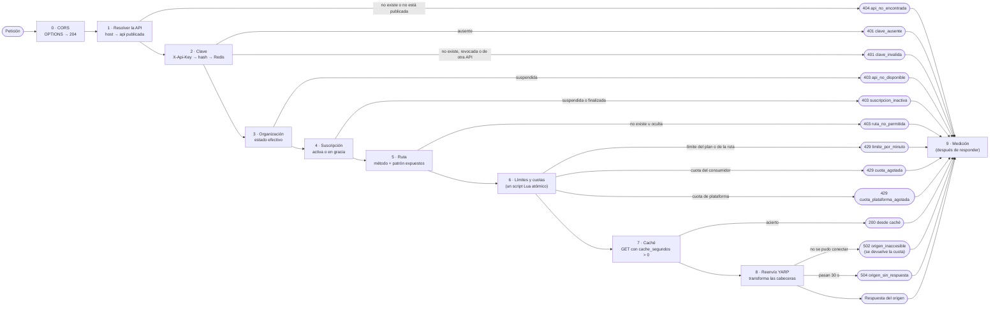

# 08 · Compuerta de tráfico (plano de datos)

La compuerta es el proceso `Shapi.Compuerta`: ASP.NET Core con YARP y una tubería de filtros. **Solo depende de Redis** ([RNF-02](03-requisitos.md#rnf-02), [RNF-04](03-requisitos.md#rnf-04)).

## 1. Contrato de entrada

- **Host:** `{sub}.api.shapi.localhost` o un dominio propio verificado.
- **Clave:** en la cabecera `X-Api-Key: shp_prod_…` o `shp_prueba_…`. **No se aceptan claves en la query string**, para que no queden en los registros de acceso.
- **Ruta y método:** los de la especificación del proveedor. El patrón se compara con la sintaxis de OpenAPI (`/rastreo/{guia}` coincide con `/rastreo/GT123`). Si dos patrones coinciden, gana el más específico: primero el que tiene más segmentos literales y, si empatan, el que tiene menos parámetros.
- **Cuerpo:** máximo 10 MB. Si es más grande se responde 413 `cuerpo_demasiado_grande`.
- **Tiempo de espera del origen:** 30 segundos.
- **Salud:** `GET /salud` solo responde cuando el `Host` es `localhost`, para no tapar una ruta `/salud` de las APIs. Con cualquier otro host, la petición pasa por la tubería.

## 2. Formato de la clave

`{prefijo}{26 caracteres base62}`, con prefijo `shp_prod_` o `shp_prueba_`. Por ejemplo, `shp_prod_4fN8qT2xLm6Rv0Zk9Wd3Hs7c2e` (unos 154 bits de entropía). Se genera con `RandomNumberGenerator`. En la base de datos se guarda `SHA-256(clave completa)` en hex, el prefijo y los últimos 4 caracteres ([ADR-01](12-decisiones.md)).

## 3. Tubería de filtros

Cada filtro implementa `IFiltroCompuerta` y devuelve `Continuar` o `Rechazar(código, error)`. El orden se define en un solo lugar (`TuberiaCompuerta`), y **agregar una regla es agregar una clase y una línea** ([RNF-13](03-requisitos.md#rnf-13)).



### Detalle de cada filtro

| # | Filtro | Qué hace | Datos que usa (Redis) |
|---|---|---|---|
| 0 | `FiltroCors` | Responde el *preflight* `OPTIONS` sin clave, con 204 y las cabeceras de [§6](#6-cors). A las demás respuestas les agrega `Access-Control-*` | `api:{id}.portal_host` |
| 1 | `FiltroApi` | `host → api_id → api:{id}`. Exige `estado = publicada` | `api:host:{host}`, `api:{id}`, `api:{id}:rutas` |
| 2 | `FiltroClave` | Calcula el SHA-256 de `X-Api-Key` y busca `clave:{hash}`. Exige que `api_id` coincida con la API resuelta; si no coincide, responde `clave_invalida`, porque no se aceptan claves de otra API | `clave:{hash}` |
| 3 | `FiltroOrganizacion` | Exige `estado_efectivo = activa` | `org:{id}` |
| 4 | `FiltroSuscripcion` | Exige que `estado ∈ {activa, en_gracia}`. **No compara fechas**: los cambios de estado los hace el trabajador cada minuto (CU-16). Así, si el trabajador está caído, el servicio sigue funcionando en vez de cortarse ([RNF-04](03-requisitos.md#rnf-04)), y el reloj del modo demostración no afecta a la compuerta | `susc:{id}` |
| 5 | `FiltroRuta` | Busca la coincidencia de método y patrón entre las rutas `expuesta = true` | `api:{id}:rutas` (ya cargado) |
| 6 | `FiltroLimitesYCuotas` | Ejecuta el script Lua `evaluar_limites.lua` (ver abajo). Con la clave de pruebas usa los límites fijos de [RF-45](03-requisitos.md#rf-45) y no toca las cuotas | `rl:*`, `cuota:*` |
| 7 | `FiltroCache` | Solo aplica a GET con `cache_segundos > 0`. Si encuentra `cache:…`, responde desde ahí; si no, marca la respuesta para guardarla si el origen devuelve 200 | `cache:*` |
| 8 | Reenvío (YARP) | Destino = `url_origen` + el camino y la query. Quita `X-Api-Key` y las cabeceras `X-Shapi-*` que haya puesto el cliente. Agrega `X-Shapi-Consumidor: {consumidor_id}`, `X-Shapi-Entorno: produccion\|pruebas`, `X-Shapi-Secreto: {secreto}` y `X-Forwarded-For/Proto/Host`. Usa un `SocketsHttpHandler.ConnectCallback` que **rechaza direcciones internas** ([RNF-10](03-requisitos.md#rnf-10)) | `api:{id}.url_origen`, `.secreto` |
| 9 | `MedicionMiddleware` | Siempre se ejecuta y va **al final**. Incrementa `met:{…}` en un *pipeline* sin esperar la respuesta de Redis (*fire-and-forget*) y agrega la llave a `met:pendientes` | `met:*` |

### Script `evaluar_limites.lua`

Es una sola llamada a Redis, que es atómica:

```
ENTRADAS: rl_s, rl_r (opcional), cuota_s, cuota_o, limite_plan, limite_ruta, peso, cuota_llamadas, cuota_peticiones, ttl_s, ttl_o
1. n_s = INCR rl_s (EXPIRE 120 si es la primera vez); si n_s > limite_plan         → DECR rl_s; devolver {429, 'limite_por_minuto'}
2. si rl_r: n_r = INCR rl_r (EXPIRE 120); si n_r > limite_ruta                      → revertir 1 y 2; devolver {429, 'limite_por_minuto'}
3. c_s = INCRBY cuota_s peso (EXPIREAT ttl_s); si c_s > cuota_llamadas              → revertir 1, 2 y 3; devolver {429, 'cuota_agotada'}
4. c_o = INCR cuota_o (EXPIREAT ttl_o); si c_o > cuota_peticiones                   → revertir 1 a 4; devolver {429, 'cuota_plataforma_agotada'}
5. devolver {200, restante_minuto, restante_cuota, segundos_para_reiniciar}
```

- Como la reserva es atómica, **la cuota nunca se excede**, ni siquiera con peticiones concurrentes ([ADR-21](12-decisiones.md)).
- Si el origen **no se pudo conectar** (502), la compuerta devuelve la reserva: `DECRBY cuota_s peso` y `DECR cuota_o`.
- Los errores 4xx y 5xx del origen y los 504 **sí descuentan**, porque la petición llegó al origen.
- Las respuestas desde caché **descuentan**, porque el consumidor recibió los datos.
- El límite por minuto usa una ventana fija de 60 segundos alineada al minuto (`minuto_epoch = floor(unix/60)`).

## 4. Contrato de errores

Todos los rechazos de la compuerta responden con `Content-Type: application/json; charset=utf-8`:

```json
{
  "error": {
    "codigo": "cuota_agotada",
    "mensaje": "Agotó las 50,000 llamadas de su plan Comercio en este ciclo. La cuota se renueva el 1 de octubre de 2026.",
    "estado": 429
  }
}
```

| Estado | Código | Cuándo | Cabeceras adicionales |
|---|---|---|---|
| 401 | `clave_ausente` | Falta `X-Api-Key` | `WWW-Authenticate: ApiKey header="X-Api-Key"` |
| 401 | `clave_invalida` | La clave no existe, está revocada, era una clave rotada que ya venció o es de otra API | ídem |
| 403 | `api_no_disponible` | La organización proveedora está suspendida (por falta de pago o por el administrador) | — |
| 403 | `suscripcion_inactiva` | La suscripción del consumidor está suspendida o finalizada | — |
| 403 | `ruta_no_permitida` | El método y la ruta no existen o están ocultos | — |
| 404 | `api_no_encontrada` | El host no corresponde a ninguna API publicada | — |
| 413 | `cuerpo_demasiado_grande` | El cuerpo pesa más de 10 MB | — |
| 429 | `limite_por_minuto` | Se pasó el límite de peticiones por minuto del plan o de la ruta | `Retry-After` (segundos para el siguiente minuto) |
| 429 | `cuota_agotada` | Se agotó la cuota de llamadas del ciclo | `Retry-After` (segundos para que termine el ciclo) |
| 429 | `cuota_plataforma_agotada` | El **proveedor** agotó la cuota de peticiones de su plan de plataforma | `Retry-After` |
| 502 | `origen_inaccesible` | No se pudo conectar con el origen, o el origen apunta a una dirección prohibida | — |
| 504 | `origen_sin_respuesta` | El origen tardó más de 30 segundos | — |

Las respuestas del **origen** se devuelven tal cual, incluidos sus errores. Las métricas las cuentan como `origen_4xx` y `origen_5xx`.

## 5. Cabeceras

**En las respuestas que traen una clave válida** (incluidos los 429):

| Cabecera | Valor |
|---|---|
| `X-Shapi-Plan` | Nombre del plan, por ejemplo `Comercio`. En las claves de pruebas es `Pruebas` |
| `X-RateLimit-Limit` | El límite por minuto que aplica (el menor entre el del plan y el de la ruta) |
| `X-RateLimit-Remaining` | Peticiones que quedan en el minuto actual |
| `X-RateLimit-Reset` | Segundos hasta el siguiente minuto |
| `X-Cuota-Limite` | Llamadas del ciclo según el plan |
| `X-Cuota-Restante` | Llamadas que quedan en el ciclo |
| `X-Cuota-Reinicio` | Fecha ISO 8601 en que termina el ciclo |
| `X-Shapi-Cache` | `HIT` o `MISS` (solo en las rutas con caché) |

**Hacia el origen:** `X-Shapi-Consumidor`, `X-Shapi-Entorno`, `X-Shapi-Secreto` y `X-Forwarded-*`. **Nunca** se envían `X-Api-Key` ni las cookies del portal. El `Host` que recibe el origen es el de `url_origen`, no el de la API en Shapi. El host original viaja en `X-Forwarded-Host`. Si el cliente manda `X-Shapi-Consumidor` o `X-Shapi-Entorno`, la compuerta reemplaza sus valores.

## 6. CORS

- `Access-Control-Allow-Origin`: solo el host del portal de esa API (`https://{sub}.shapi.localhost`). Las peticiones sin `Origin`, que son las de servidor a servidor, pasan sin restricción.
- `Access-Control-Allow-Methods`: los de las rutas expuestas.
- `Access-Control-Allow-Headers`: `X-Api-Key, Content-Type, Accept`.
- `Access-Control-Expose-Headers`: todas las de [§5](#5-cabeceras).
- `Access-Control-Max-Age: 600`.

## 7. Medición y consolidación

**Durante cada petición**, el filtro 9 hace `HINCRBY` sobre la llave `met:{aaaammdd}:{api}:{ruta|-}:{susc|-}:{entorno}`:

- `peticiones +1`.
- `llamadas +peso`, solo si la petición descontó cuota.
- `bytes_entrada` y `bytes_salida`.
- El contador del código correspondiente: `r401`, `r403`, `r404`, `r429`, `o2xx`, `o3xx`, `o4xx`, `o5xx` u `ofallo`.
- `h_t_{i}` y `h_c_{i}`, que son el rango del histograma para la latencia total y para la de la compuerta.
- `lt_suma` y `lc_suma`.

La **latencia de la compuerta** es la latencia total menos el tiempo de espera del origen, medido desde que se envía la petición hasta que llega el primer byte de la respuesta.

**Consolidación** (el trabajador, cada 10 segundos, es idempotente; ver la secuencia en [06 §5.7](06-arquitectura.md#57-consolidacion-del-consumo)):

1. `lote_id = nuevo UUID`. Por cada llave de `met:pendientes`: `SREM` y luego `RENAME llave → met:lote:{lote_id}:{llave}`. Si la llave ya no existe, se ignora.
2. Lee todos los `met:lote:{lote_id}:*` y abre una transacción en PostgreSQL:
   - `INSERT INTO lote_consolidado(lote_id)`;
   - `INSERT … ON CONFLICT (fecha, api_id, ruta_id, suscripcion_id, entorno) DO UPDATE SET` sumando cada contador y cada posición de los arreglos del histograma;
   - `COMMIT`.
3. `DEL met:lote:{lote_id}:*`.
4. **Recuperación:** al arrancar, el trabajador busca `met:lote:*`. Si el `lote_id` ya está en `lote_consolidado`, solo borra las llaves; si no, repite los pasos 2 y 3.

**Cálculo del p95** ([RF-35](03-requisitos.md#rf-35)): se suman los histogramas de las filas del periodo y se busca el rango `i` donde la suma acumulada alcanza el 95 % del total. Luego se interpola linealmente entre el límite inferior y el superior de ese rango. El último rango (más de 2500 ms) se reporta como `> 2500 ms`.

## 8. Rendimiento

- Por cada petición se hacen dos viajes a Redis antes de reenviar (un *pipeline* para el contexto y el script Lua), más uno en segundo plano para la medición.
- La compuerta **no guarda en memoria** los datos de claves, suscripciones ni organizaciones. Así una revocación o una suspensión se aplica al instante ([RF-28](03-requisitos.md#rf-28)), a costa de consultar Redis en cada petición ([ADR-22](12-decisiones.md)). Lo único que se guarda en memoria, durante 5 segundos como máximo, es `api:{id}:rutas`, junto con su `version`.
- Hay una conexión multiplexada a Redis (StackExchange.Redis) y un `HttpClient` de YARP por destino, con *pooling* de conexiones.
- **Pruebas de aceptación:** RNF-01 y RNF-03 se miden con k6 contra `origen-envios` en el ambiente productivo simulado. Los resultados se documentan en el manual técnico.
