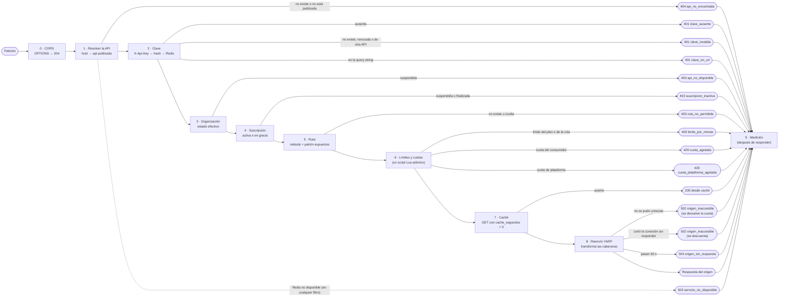

# 08 · Compuerta de tráfico (plano de datos)

La compuerta es el proceso `Shapi.Compuerta`: ASP.NET Core con YARP y una tubería de filtros. **Solo depende de Redis** ([RNF-02](03-requisitos.md#rnf-02), [RNF-04](03-requisitos.md#rnf-04)).

## 1. Contrato de entrada

- **Host:** `{sub}.api.shapi.localhost` o un dominio propio verificado.
- **Clave:** en la cabecera `X-Api-Key: shp_prod_…` o `shp_prueba_…`. **No se aceptan claves en la query string**, para que no queden en los registros de acceso. Si el nombre o el valor de un parámetro de la query contiene una clave con el formato de [§2](#2-formato-de-la-clave), sola o dentro de un texto más largo, la compuerta responde 401 `clave_en_url` y no reenvía la petición, aunque también venga `X-Api-Key`. Los demás parámetros (por ejemplo, un `key` del proveedor) se reenvían. La compuerta tampoco registra la URL de destino con su query.
- **Ruta y método:** los de la especificación del proveedor. El patrón se compara con la sintaxis de OpenAPI (por ejemplo, `/guias/{numero}` coincide con `/guias/GT123`). Si dos patrones coinciden, gana el más específico: primero el que tiene más segmentos literales y, si empatan, el que tiene menos parámetros. Los segmentos literales no distinguen mayúsculas, porque muchos orígenes tampoco las distinguen: así `/guias/RECIENTES` no se salta una ruta oculta `/guias/recientes`.
- **Cuerpo:** máximo 10 MB (10 × 1024 × 1024 bytes). Si es más grande se responde 413 `cuerpo_demasiado_grande`. Si el `Content-Length` lo anuncia, se rechaza antes de leer Redis; si no lo anuncia (cuerpo por partes), se corta al pasar el límite mientras se reenvía.
- **Tiempo de espera del origen:** 30 segundos **en total**, desde que se reenvía la petición hasta que termina la respuesta; no es un tiempo de inactividad. Si vence antes de que el origen responda, 504 `origen_sin_respuesta`. Si la respuesta ya empezó, se corta. Dentro de esos 30 segundos, la conexión con el origen tiene 10 segundos, incluida la resolución del nombre; si no se conecta, 502 `origen_inaccesible` (no 504, aunque el cliente lo reporte como tiempo vencido).
- **Salud:** `GET /salud` solo responde cuando el `Host` es `localhost`, para no tapar una ruta `/salud` de las APIs. Con cualquier otro host, la petición pasa por la tubería.

## 2. Formato de la clave

`{prefijo}{26 caracteres base62}`, con prefijo `shp_prod_` o `shp_prueba_`. Por ejemplo, `shp_prod_4fN8qT2xLm6Rv0Zk9Wd3Hs7c2e` (unos 154 bits de entropía). Se genera con `RandomNumberGenerator`. En la base de datos se guarda `SHA-256(clave completa)` en hex, el prefijo y los últimos 4 caracteres ([ADR-01](12-decisiones.md)).

## 3. Tubería de filtros

Cada filtro implementa `IFiltroCompuerta` y devuelve `Continuar` o `Rechazar(código, error)`. El orden se define en un solo lugar (`TuberiaCompuerta`), y **agregar una regla es agregar una clase y una línea** ([RNF-13](03-requisitos.md#rnf-13)).


```mermaid
flowchart LR
  IN(["Petición"]) --> F0
  F0["0 · CORS<br/>OPTIONS → 204"] --> F1
  F1["1 · Resolver la API<br/>host → api publicada"] -- "no existe o no está publicada" --> R404(["404 api_no_encontrada"])
  F1 --> F2["2 · Clave<br/>X-Api-Key → hash → Redis"]
  F2 -- "ausente" --> R401a(["401 clave_ausente"])
  F2 -- "no existe, revocada o de otra API" --> R401b(["401 clave_invalida"])
  F2 -- "en la query string" --> R401c(["401 clave_en_url"])
  F1 -. "Redis no disponible (en cualquier filtro)" .-> R503(["503 servicio_no_disponible"])
  F2 --> F3["3 · Organización<br/>estado efectivo"]
  F3 -- "suspendida" --> R403a(["403 api_no_disponible"])
  F3 --> F4["4 · Suscripción<br/>activa o en gracia"]
  F4 -- "suspendida o finalizada" --> R403b(["403 suscripcion_inactiva"])
  F4 --> F5["5 · Ruta<br/>método + patrón expuestos"]
  F5 -- "no existe u oculta" --> R403c(["403 ruta_no_permitida"])
  F5 --> F6["6 · Límites y cuotas<br/>(un script Lua atómico)"]
  F6 -- "límite del plan o de la ruta" --> R429a(["429 limite_por_minuto"])
  F6 -- "cuota del consumidor" --> R429b(["429 cuota_agotada"])
  F6 -- "cuota de plataforma" --> R429c(["429 cuota_plataforma_agotada"])
  F6 --> F7["7 · Caché<br/>GET con cache_segundos > 0"]
  F7 -- "acierto" --> HIT(["200 desde caché"])
  F7 --> F8["8 · Reenvío YARP<br/>transforma las cabeceras"]
  F8 -- "no se pudo conectar" --> R502(["502 origen_inaccesible<br/>(se devuelve la cuota)"])
  F8 -- "cortó la conexión sin responder" --> R502b(["502 origen_inaccesible<br/>(se descuenta)"])
  F8 -- "pasan 30 s" --> R504(["504 origen_sin_respuesta"])
  F8 --> OK(["Respuesta del origen"])
  OK & HIT & R404 & R401a & R401b & R401c & R503 & R403a & R403b & R403c & R429a & R429b & R429c & R502 & R502b & R504 --> F9["9 · Medición<br/>(después de responder)"]
```

### Detalle de cada filtro

| # | Filtro | Qué hace | Datos que usa (Redis) |
|---|---|---|---|
| 0 | `FiltroCors` | Responde el *preflight* (`OPTIONS` con `Origin` y `Access-Control-Request-Method`) sin clave, con 204 y las cabeceras de [§6](#6-cors). A las demás respuestas les agrega `Access-Control-*`. Si el host no tiene una API publicada, el *preflight* sigue y el filtro 1 responde 404 | `api:{id}.portal_host` |
| 1 | `FiltroApi` | `host → api_id → api:{id}`. Exige `estado = publicada` | `api:host:{host}`, `api:{id}`, `api:{id}:rutas` |
| 2 | `FiltroClave` | Rechaza una clave en la query string ([§1](#1-contrato-de-entrada)). Calcula el SHA-256 de `X-Api-Key` y busca `clave:{hash}`. Exige que `api_id` coincida con la API resuelta; si no coincide, responde `clave_invalida`, porque no se aceptan claves de otra API | `clave:{hash}` |
| 3 | `FiltroOrganizacion` | Exige `estado_efectivo = activa`. Si `org:{id}` no está en Redis, el estado no se puede comprobar y también se rechaza | `org:{id}` |
| 4 | `FiltroSuscripcion` | Exige que `estado ∈ {activa, en_gracia}`. Una suscripción finalizada no tiene `susc:{id}` ([07 §4](07-modelo-de-datos.md#4-estructura-de-las-llaves-en-redis)), así que una llave ausente se rechaza igual. **No compara fechas**: los cambios de estado los hace el trabajador cada minuto (CU-16). Así, si el trabajador está caído, el servicio sigue funcionando en vez de cortarse ([RNF-04](03-requisitos.md#rnf-04)), y el reloj del modo demostración no afecta a la compuerta | `susc:{id}` |
| 5 | `FiltroRuta` | Busca, entre todas las rutas del método, la que mejor coincide con el camino según la regla de especificidad de [§1](#1-contrato-de-entrada), y exige que esté `expuesta = true`. Si la que gana está oculta, se rechaza aunque un patrón más general esté expuesto: ocultar `/guias/recientes` no sirve si `/guias/{numero}` la deja pasar ([RF-10](03-requisitos.md#rf-10)). En un empate total gana la oculta | `api:{id}:rutas` (ya cargado) |
| 6 | `FiltroLimitesYCuotas` | Ejecuta el script Lua `evaluar_limites.lua` (ver abajo). Con la clave de pruebas usa los límites fijos de [RF-45](03-requisitos.md#rf-45) y no toca las cuotas | `rl:*`, `cuota:*` |
| 7 | `FiltroCache` | Solo aplica a GET con `cache_segundos > 0`. Si encuentra `cache:…`, responde desde ahí; si no, marca la respuesta para guardarla si el origen devuelve 200 | `cache:*` |
| 8 | Reenvío (YARP) | Destino = `url_origen` + el camino y la query. Quita `X-Api-Key` y las cabeceras `X-Shapi-*` que haya puesto el cliente. Agrega `X-Shapi-Consumidor: {consumidor_id}`, `X-Shapi-Entorno: produccion\|pruebas`, `X-Shapi-Secreto: {secreto}` (si la API lo tiene) y `X-Forwarded-For/Proto/Host` ([§5](#5-cabeceras)). Usa un `SocketsHttpHandler.ConnectCallback` que **rechaza direcciones internas** y se conecta a una de las direcciones ya validadas ([RNF-10](03-requisitos.md#rnf-10), [10 §4](10-identidad-y-seguridad.md#4-proteccion-del-origen-ssrf)) | `api:{id}.url_origen`, `.secreto` |
| 9 | `MedicionMiddleware` | Siempre se ejecuta y va **al final**. Incrementa `met:{…}` en un *pipeline* sin esperar la respuesta de Redis (*fire-and-forget*) y agrega la llave a `met:pendientes` | `met:*` |

### Script `evaluar_limites.lua`

Es una sola llamada a Redis, que es atómica:

```
ENTRADAS: rl_s, rl_r (opcional), cuota_s, cuota_o (opcional), limite_plan, limite_ruta, peso, cuota_llamadas, cuota_peticiones, ttl_s, ttl_o
1. n_s = INCR rl_s (EXPIRE 120 si es la primera vez); si n_s > limite_plan         → DECR rl_s; devolver {1, contadores}  (limite_por_minuto, del plan)
2. si rl_r: n_r = INCR rl_r (EXPIRE 120); si n_r > limite_ruta                      → revertir 1 y 2; devolver {2, contadores}  (limite_por_minuto, de la ruta)
3. c_s = INCRBY cuota_s peso (EXPIREAT ttl_s); si c_s > cuota_llamadas              → revertir 1, 2 y 3; devolver {3, contadores}  (cuota_agotada)
4. si cuota_o: c_o = INCR cuota_o (EXPIREAT ttl_o); si c_o > cuota_peticiones                   → revertir 1 a 4; devolver {4, contadores}  (cuota_plataforma_agotada)
5. devolver {0, contadores}

contadores = n_s, n_r, c_s, c_o, leídos después de reservar o de revertir (0 si la llave no aplica)
```

- Como la reserva es atómica, **la cuota nunca se excede**, ni siquiera con peticiones concurrentes ([ADR-21](12-decisiones.md)).
- Si el origen **no se pudo conectar** (502), la compuerta devuelve la reserva: `DECRBY cuota_s peso` y `DECR cuota_o`. Los contadores por minuto no se devuelven. Solo se devuelve si la petición no llegó al origen: la dirección se rechazó o no resolvió, el origen no aceptó la conexión, falló la conexión segura (TLS) o venció el tiempo de conexión. Si el origen aceptó la conexión, recibió la petición y la cortó antes de responder, también es 502 `origen_inaccesible`, pero la cuota **se descuenta**.
- Los errores 4xx y 5xx del origen y los 504 **sí descuentan**, porque la petición llegó al origen.
- Las respuestas desde caché **descuentan**, porque el consumidor recibió los datos.
- El límite por minuto usa una ventana fija de 60 segundos alineada al minuto (`minuto_epoch = floor(unix/60)`).
- `rl_r` solo se usa si la ruta tiene `limite_minuto`, y `cuota_o` solo si `org:{id}` tiene `cuota_peticiones` y ciclo: la organización de la plataforma no tiene cuota de plataforma ([07 §4](07-modelo-de-datos.md#4-estructura-de-las-llaves-en-redis)).
- `ttl_s` y `ttl_o` son `fin + 8 días`. Si el `fin` ya pasó (un ciclo que el trabajador todavía no cierra, [RNF-04](03-requisitos.md#rnf-04)), se cuentan 8 días desde ahora: un `EXPIREAT` en el pasado borraría el contador y reiniciaría la cuota en cada petición.
- **Modo demostración** ([09 §9](09-cobros-y-suscripciones.md#9-modo-demostración)): el `inicio` y el `fin` de `susc:{id}` y de `org:{id}` vienen en la hora de `IReloj`, que puede ir adelantada, mientras la compuerta usa la hora real. La cuota se cuenta bien, porque la llave depende del `inicio`, pero el `Retry-After` de `cuota_agotada` y de `cuota_plataforma_agotada` se mide contra la hora real y puede salir más largo que en el reloj de la demostración. `X-Cuota-Reinicio` y la fecha del mensaje de `cuota_agotada` muestran el `fin` tal cual, en la hora de la demostración. Se acepta así.
- Al rechazar, el script devuelve también los contadores ya revertidos, para las cabeceras de [§5](#5-cabeceras). Así no hace falta otra llamada.
- La compuerta lo llama siempre con `EVALSHA`. Si Redis no tiene el script, porque se reinició o vació su caché de scripts, responde `NOSCRIPT` sin ejecutar nada. Entonces la compuerta lo ejecuta una vez con `EVAL`, que lo deja guardado.
- **Clave de pruebas** ([RF-45](03-requisitos.md#rf-45)): el mismo script, con `rl_s = rl:p:{clave_id}:{minuto_epoch}` y `limite_plan = 10`, sin `rl_r` ni `cuota_o`, y con el contador diario `dia:p:{clave_id}:{aaaammdd}` en el lugar de `cuota_s` (`peso = 1` y límite 1,000). No se usa el límite de la ruta. Al pasar las 1,000 peticiones del día se responde 429 `cuota_agotada`, con `Retry-After` hasta la medianoche de Guatemala. Como no toca las cuotas, un 502 no devuelve nada.

## 4. Contrato de errores

Todos los rechazos de la compuerta responden con `Content-Type: application/json; charset=utf-8`:

```json
{
  "error": {
    "codigo": "cuota_agotada",
    "mensaje": "Agotó las 50,000 llamadas de su plan Comercio en este ciclo. La cuota se renueva el 1 de octubre de 2026.",
    "estado": 429
  }
}
```

| Estado | Código | Cuándo | Cabeceras adicionales |
|---|---|---|---|
| 401 | `clave_ausente` | Falta `X-Api-Key` | `WWW-Authenticate: ApiKey header="X-Api-Key"` |
| 401 | `clave_invalida` | La clave no existe, está revocada, era una clave rotada que ya venció o es de otra API. También si llegan varias `X-Api-Key` | ídem |
| 401 | `clave_en_url` | Un parámetro de la query string contiene una clave ([§1](#1-contrato-de-entrada)) | ídem |
| 403 | `api_no_disponible` | La organización proveedora está suspendida (por falta de pago o por el administrador) | — |
| 403 | `suscripcion_inactiva` | La suscripción del consumidor está suspendida o finalizada | — |
| 403 | `ruta_no_permitida` | El método y la ruta no existen o están ocultos | — |
| 404 | `api_no_encontrada` | El host no corresponde a ninguna API publicada | — |
| 413 | `cuerpo_demasiado_grande` | El cuerpo pesa más de 10 MB | — |
| 429 | `limite_por_minuto` | Se pasó el límite de peticiones por minuto del plan o de la ruta | `Retry-After` (segundos para el siguiente minuto) |
| 429 | `cuota_agotada` | Se agotó la cuota de llamadas del ciclo. Con la clave de pruebas, se pasaron las 1,000 peticiones del día | `Retry-After` (segundos para que termine el ciclo o, con la clave de pruebas, para la medianoche de Guatemala; 1 si el ciclo ya terminó) |
| 429 | `cuota_plataforma_agotada` | El **proveedor** agotó la cuota de peticiones de su plan de plataforma | `Retry-After` (segundos para que termine el ciclo de plataforma) |
| 502 | `origen_inaccesible` | No se pudo conectar con el origen en 10 segundos, el origen apunta a una dirección prohibida, o cortó la conexión sin responder | — |
| 503 | `servicio_no_disponible` | Redis no está disponible: la compuerta no puede validar la petición ([RNF-04](03-requisitos.md#rnf-04)) | `Retry-After: 5` |
| 504 | `origen_sin_respuesta` | El origen no respondió en 30 segundos (si la respuesta ya había empezado, se corta) | — |

Las respuestas del **origen** se devuelven tal cual, incluidos sus errores. Las métricas las cuentan como `origen_4xx` y `origen_5xx`.

## 5. Cabeceras

**En las respuestas que traen una clave válida** (incluidos los 429). Son las que llegan al filtro 6: un rechazo de los filtros 1 a 5 no las lleva. También las llevan los 502 y los 504 del reenvío, y reemplazan las que mande el origen con el mismo nombre:

| Cabecera | Valor |
|---|---|
| `X-Shapi-Plan` | Nombre del plan, por ejemplo `Comercio`. En las claves de pruebas es `Pruebas`. Va codificado como componente de URI, en UTF-8 con porcentajes, porque una cabecera solo admite ASCII: `Básico` viaja como `B%C3%A1sico` y se lee con `decodeURIComponent` |
| `X-RateLimit-Limit` | El límite por minuto que aplica (el menor entre el del plan y el de la ruta) |
| `X-RateLimit-Remaining` | Peticiones que quedan en el minuto actual: la menor entre lo que queda del límite del plan y del de la ruta |
| `X-RateLimit-Reset` | Segundos hasta el siguiente minuto |
| `X-Cuota-Limite` | Llamadas del ciclo según el plan |
| `X-Cuota-Restante` | Llamadas que quedan en el ciclo |
| `X-Cuota-Reinicio` | Fecha ISO 8601 en UTC en que termina el ciclo, por ejemplo `2026-10-31T06:00:00Z` |
| `X-Shapi-Cache` | `HIT` o `MISS` (solo en las rutas con caché) |

Con la clave de pruebas, `X-RateLimit-Limit` es 10, y las `X-Cuota-*` informan el límite diario: `X-Cuota-Limite: 1000`, las peticiones que quedan en el día y la medianoche de Guatemala en que se renueva.

**Hacia el origen:** `X-Shapi-Consumidor`, `X-Shapi-Entorno`, `X-Shapi-Secreto` y `X-Forwarded-*`. **Nunca** se envían `X-Api-Key` ni las cookies de sesión de Shapi: de la cabecera `Cookie` se quitan `shapi_sesion` y `portal_sesion`, y las demás cookies pasan. El `Host` que recibe el origen es el de `url_origen`, no el de la API en Shapi. El host original viaja en `X-Forwarded-Host`. Cualquier `X-Shapi-*` que mande el cliente se quita, así que no puede cambiar el consumidor, el entorno ni el secreto.

- `X-Forwarded-For`: la cadena que haya llegado, más la IP de quien se conectó a la compuerta.
- `X-Forwarded-Proto`: el que mande el borde (Caddy), que le habla a la compuerta por `http`; si no llega `http` o `https`, el esquema de la conexión.
- `X-Forwarded-Host`: el `Host` con que llegó la petición.

## 6. CORS

- `Access-Control-Allow-Origin`: solo el host del portal de esa API (`https://{sub}.shapi.localhost`). Se acepta un `Origin` cuyo host es el `portal_host` de la API, con `http` o `https` y cualquier puerto, y se devuelve tal como llegó. Las peticiones sin `Origin`, que son las de servidor a servidor, pasan sin restricción. Las de otro origen pasan, pero sin las cabeceras de CORS.
- `Access-Control-Allow-Methods`: los de las rutas expuestas (solo en el *preflight*).
- `Access-Control-Allow-Headers`: `X-Api-Key, Content-Type, Accept` (solo en el *preflight*).
- `Access-Control-Expose-Headers`: todas las de [§5](#5-cabeceras) (en las demás respuestas).
- `Access-Control-Max-Age: 600` (solo en el *preflight*).
- El *preflight* de otro origen también recibe 204, sin esas cabeceras.
- Las cabeceras se agregan a todas las respuestas, también a los rechazos de [§4](#4-contrato-de-errores), para que el portal pueda leer el error. Hay dos excepciones, porque salen antes de conocer la API: el 413 de un `Content-Length` de más de 10 MB y el 503 de Redis no disponible. Las `Access-Control-*` que mande el origen se quitan: el origen no puede abrir el CORS a otros sitios. Toda respuesta a una petición con `Origin` lleva `Vary: Origin`.

## 7. Medición y consolidación

**Durante cada petición**, el filtro 9 hace `HINCRBY` sobre la llave `met:{aaaammdd}:{api}:{ruta|-}:{susc|-}:{entorno}`:

- `peticiones +1`.
- `llamadas +peso`, solo si la petición descontó cuota.
- `bytes_entrada` y `bytes_salida`.
- El contador del código correspondiente: `r401`, `r403`, `r404`, `r429`, `o2xx`, `o3xx`, `o4xx`, `o5xx` u `ofallo`.
- `h_t_{i}` y `h_c_{i}`, que son el rango del histograma para la latencia total y para la de la compuerta.
- `lt_suma` y `lc_suma`.

La **latencia de la compuerta** es la latencia total menos el tiempo de espera del origen, medido desde que se envía la petición hasta que llega el primer byte de la respuesta.

Los incrementos de una petición y su `SADD met:pendientes` se envían juntos en un pipeline `MULTI/EXEC` con *fire-and-forget*. Así la consolidación nunca separa una petición entre dos lotes. Los bytes son los cuerpos efectivamente leídos y escritos, sin almacenar su contenido. El día se toma al comenzar la petición, en Guatemala. Si el origen falla sin responder, la espera termina al producirse el fallo; sus 502 y 504 incrementan `ofallo`, mientras que un 502 devuelto por el propio origen incrementa `o5xx`. Las claves rechazadas no atribuyen consumo a una suscripción, aunque el lector haya encontrado una clave de otra API.

Si no se pudo resolver una API (por ejemplo, un host desconocido o un cuerpo rechazado antes de leer Redis), `{api}` es el UUID nulo `00000000-0000-0000-0000-000000000000`, `{ruta}` y `{susc}` son `-` y el entorno es `produccion`. Esos contadores globales se conservan en Redis; no se insertan en `consumo_diario`, que exige una API real. No se atribuyen a un proveedor.

**Consolidación** (el trabajador, cada 10 segundos, es idempotente; ver la secuencia en [06 §5.7](06-arquitectura.md#57-consolidacion-del-consumo)):

1. `lote_id = nuevo UUID`. Por cada llave de `met:pendientes`: `SREM` y luego `RENAME llave → met:lote:{lote_id}:{llave}`. Si la llave ya no existe, se ignora.
   El `SREM` y los `RENAME` del lote se ejecutan en un único script Lua, que primero valida todas las llaves y cierra la instantánea antes de que pueda leerla otro trabajador. Cada lote contiene hasta 256 llaves para acotar la duración del script; se repite con un nuevo UUID hasta vaciar las métricas de APIs identificadas. Una interrupción no deja un hash sin pertenecer a `met:pendientes` o a un lote recuperable.
2. Lee todos los `met:lote:{lote_id}:*` y abre una transacción en PostgreSQL:
   - `INSERT INTO lote_consolidado(lote_id)`;
   - `INSERT … ON CONFLICT (fecha, api_id, ruta_id, suscripcion_id, entorno) DO UPDATE SET` sumando cada contador y cada posición de los arreglos del histograma;
   - `COMMIT`.
3. `DEL met:lote:{lote_id}:*`.
4. **Recuperación:** al arrancar, el trabajador busca `met:lote:*`. Si el `lote_id` ya está en `lote_consolidado`, solo borra las llaves; si no, repite los pasos 2 y 3.

La recuperación se repite también al principio de cada intervalo de 10 segundos, para recuperarse de fallos temporales sin reiniciar. El marcador usa `ON CONFLICT DO NOTHING` dentro de la misma transacción; un lote ya aplicado no suma contadores otra vez, incluso si otro trabajador lo recupera simultáneamente. Cada lote deduplica las llaves devueltas por `SCAN` antes de leer sus hashes: Redis puede devolver una misma llave varias veces. Al consolidar, una ruta retirada se trata como `ruta_id` nulo, conforme a 07 §3.5. El UPSERT conserva `creado_en` y actualiza `actualizado_en` con `IReloj`.

**Cálculo del p95** ([RF-35](03-requisitos.md#rf-35)): se suman los histogramas de las filas del periodo y se busca el rango `i` donde la suma acumulada alcanza el 95 % del total. Luego se interpola linealmente entre el límite inferior y el superior de ese rango. El último rango (más de 2500 ms) se reporta como `> 2500 ms`.

## 8. Rendimiento

- Por cada petición se hacen tres viajes a Redis antes de reenviar, más uno en segundo plano para la medición:
  1. un *pipeline* con `api:host:{host}` y `clave:{hash}`;
  2. un *pipeline* con lo que depende de esos valores: `api:{id}`, sus rutas, `org:{id}` y `susc:{id}`;
  3. el script Lua de límites y cuotas.

  Si la ruta usa caché (filtro 7), se suma la consulta de `cache:*`. `org:{id}` y `susc:{id}` solo se piden si la clave existe y es de esa API; `org:{id}` es el `organizacion_id` de la clave, que es el de la API.
- La compuerta **no guarda en memoria** los datos de claves, suscripciones ni organizaciones. Así una revocación o una suspensión se aplica al instante ([RF-28](03-requisitos.md#rf-28)), a costa de consultar Redis en cada petición ([ADR-22](12-decisiones.md)). Lo único que se guarda en memoria, durante 5 segundos como máximo, es `api:{id}:rutas`, junto con su `version`. Mientras las rutas están en memoria, el segundo *pipeline* no las pide. Si la `version` de `api:{id}` ya no es la de las rutas en memoria, se vuelven a pedir en un viaje más: solo pasa en la primera petición después de una publicación.
- Hay una conexión multiplexada a Redis (StackExchange.Redis) y un solo invocador HTTP de YARP (`HttpMessageInvoker` con `SocketsHttpHandler`), que agrupa las conexiones por destino (*pooling*). La conexión a Redis se abre al arrancar la compuerta, antes de atender peticiones. Si se abriera con la primera, varias peticiones simultáneas esperarían bloqueadas la conexión síncrona y agotarían el *pool* de hilos durante segundos. Si Redis no responde al arrancar, la compuerta espera `connectTimeout` (5 s por defecto), empieza a atender y responde 503 `servicio_no_disponible` mientras la conexión se reintenta sola.
- **Pruebas de aceptación:** RNF-01 y RNF-03 se miden con k6 contra `origen-envios` en el ambiente productivo simulado. Los resultados se documentan en el manual técnico.
