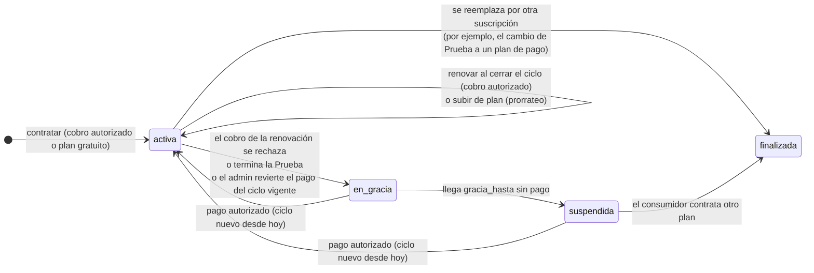

# 09 · Cobros y suscripciones

## 1. Principios

- Hay **dos niveles**: la organización contrata con Shapi (plataforma) y el consumidor contrata con el proveedor (API). **Los dos niveles usan el mismo código**: la clase base `Suscripcion`, la misma máquina de estados y el mismo prorrateo.
- El único medio de pago es la **tarjeta**, procesada por la **pasarela simulada** a través de `IPasarelaPagos` ([ADR-12](12-decisiones.md)).
- Shapi **nunca guarda** el número completo de la tarjeta ni el CVV. Guarda el **token** que emite la pasarela, la marca, los últimos 4 dígitos, el titular y el vencimiento ([ADR-13](12-decisiones.md)).
- Toda la lógica de tiempo usa `IReloj`, para que las pruebas y el modo demostración puedan adelantar la fecha.

## 2. Pasarela simulada

```csharp
public interface IPasarelaPagos
{
    Task<ResultadoTokenizacion> TokenizarAsync(DatosTarjeta tarjeta);                              // valida y devuelve el token
    Task<ResultadoCobro> CobrarAsync(string token, decimal monto, string referencia, bool esRenovacion);
    Task<ResultadoReembolso> ReembolsarAsync(string referenciaCobro);
}
```

### Reglas de la simulación (`PasarelaSimulada`)

| Validación | Regla |
|---|---|
| Número | Tiene entre 13 y 19 dígitos y pasa el **algoritmo de Luhn**. Si no, `numero_invalido` |
| Marca (según el BIN) | `4…` → Visa · `51–55…` o `2221–2720…` → Mastercard · `34…` o `37…` → American Express. Cualquier otro → `marca_no_soportada` |
| Vencimiento | Tiene que ser el mes actual o uno posterior. Si no, `tarjeta_vencida` |
| CVV | 3 dígitos, o 4 si es American Express. Si no, `cvv_invalido` |

### Tarjetas de prueba

| Número | Resultado |
|---|---|
| `4242 4242 4242 4242` | Visa · siempre se aprueba |
| `5555 5555 5555 4444` | Mastercard · siempre se aprueba |
| `4000 0000 0000 0002` | Visa · siempre se rechaza (`fondos_insuficientes`) |
| `4000 0000 0000 0069` | Visa · siempre se rechaza (`tarjeta_vencida`) |
| `4000 0000 0000 0341` | Visa · **se aprueba al contratar y se rechaza en las renovaciones**. Sirve para demostrar el periodo de gracia |
| Cualquier otro número válido según Luhn | Se aprueba. Por ejemplo, las tarjetas de los mockups: `4024 0071 2244 4821` y `5412 7534 1209 3057` |

- Con `SHAPI_PASARELA_FALLA=true`, todos los cobros fallan con `pasarela_no_disponible` (B3 la muestra fuera de servicio).
- La pasarela simulada tarda entre 300 y 800 ms en responder, para que se note la espera en la interfaz.
- El token tiene el formato `tok_sim_{uuid}`. La pasarela guarda en memoria, **solo mientras el proceso está activo**, el comportamiento de cada tarjeta especial. Además lo incluye en el token (`tok_sim_0341_{uuid}`) para no perderlo si el proceso se reinicia.
- Las referencias de cobro tienen el formato `ch_sim_{uuid}` y las de reembolso `re_sim_{uuid}`.

## 3. Máquina de estados de las suscripciones



| Estado | ¿Funciona la compuerta? | Qué muestra la interfaz |
|---|---|---|
| `activa` | Sí | "Activa", el periodo y la próxima renovación (B1.4, B2.3) |
| `en_gracia` | **Sí** | Aviso con los días que quedan y el botón "Pagar con otra tarjeta" (B1.4 gracia, B2.3 gracia) |
| `suspendida` | **No**: responde 403 (`api_no_disponible` si es la plataforma, `suscripcion_inactiva` si es la API) | "Su tráfico está detenido" y el botón para pagar (B1.4 suspendida). El consumidor ve "La API no está disponible temporalmente" si el suspendido es el proveedor (B2.3) |
| `finalizada` | No | Solo aparece en el historial |

**Parámetros** (en `appsettings`, en la sección `Cobros`): `DiasGracia = 7`, `AvisoVencimientoPruebaDias = 7`, `ReintentosRenovacion = 0`. No hay reintentos automáticos: durante la gracia paga el usuario.

## 4. Ciclos

- `inicio` es el momento de la contratación, redondeado al **inicio del día en America/Guatemala**. `fin = inicio + vigencia_dias`.
- En pantalla se muestra `inicio – (fin − 1 día)` y "Próxima renovación: `fin`". Por ejemplo, un plan de 30 días contratado el 24 de agosto de 2026 se muestra como **24 ago 2026 – 22 sep 2026** y se renueva el **23 de septiembre de 2026**.
- Al renovarse, el ciclo nuevo empieza en el `fin` anterior. Al reactivarse después de gracia o suspensión, **empieza el día del pago**.
- La cuota (`cuota:susc:*` y `cuota:org:*`) se identifica por el `inicio` del ciclo, así que se reinicia sola cuando empieza un ciclo nuevo.

## 5. Cambio de plan

**Qué cuenta como subir de plan:** que el plan nuevo tenga un **precio diario** mayor (`precio / vigencia_dias`). Si el precio diario es igual o menor, es una bajada.

### Subir de plan (se aplica de inmediato)

Sea `d = días completos que faltan del ciclo = ceil((fin − ahora) / 1 día)`:

```
credito = round(precio_actual × d / vigencia_actual, 2)
si vigencia_nueva == vigencia_actual:
    cargo   = round(precio_nuevo × d / vigencia_nueva, 2)     → el ciclo se mantiene (inicio y fin no cambian)
si no (por ejemplo, de mensual a anual):
    cargo   = precio_nuevo                                    → empieza un ciclo nuevo hoy
a_pagar = max(cargo − credito, 0)
```

**Ejemplo de A2.5:** un cambio de Lanzamiento (Q 199) a Producto (Q 599) con 13 días restantes de 30 da un crédito de 199 × 13 / 30 = **Q 86.23**, un cargo de 599 × 13 / 30 = **Q 259.57** y un monto a pagar de **Q 173.34**.

- Si `a_pagar > 0`, se cobra al medio de pago registrado o a una tarjeta nueva. Si el cobro se rechaza, **no cambia nada**.
- El pago queda con `concepto = cambio_plan` y una descripción del tipo "Lanzamiento → Producto · diferencia prorrateada".
- Un cambio **desde un plan gratuito o desde Prueba** crea una suscripción nueva (la anterior queda `finalizada`), cobra el precio completo y empieza el ciclo hoy (A2.2).

### Bajar de plan (se programa)

- Se guarda `plan_siguiente_id` y se aplica cuando se cierra el ciclo (CU-16). No se reembolsa nada.
- **Se rechaza** con `excede_limites_del_plan` si la organización tiene más APIs registradas o más miembros de los que permite el plan de destino.
- Si hay una bajada programada, la interfaz muestra "A partir del {fin} su plan será {X}" y permite cancelarla.

## 6. Límites del plan de plataforma ([RF-43](03-requisitos.md#rf-43))

| Límite | Dónde se aplica | Error |
|---|---|---|
| `max_apis` | Al registrar una API (se cuentan las APIs en cualquier estado) | `limite_del_plan` (`limite = "apis"`) |
| `max_miembros` | Al invitar a un miembro (se cuentan los miembros y las invitaciones vigentes) | `limite_del_plan` (`limite = "miembros"`) |
| `dominio_propio` | Al conectar un dominio | `plan_sin_dominio_propio` |
| `cuota_peticiones` | En la compuerta (filtro 6) | 429 `cuota_plataforma_agotada` |

**Avisos de cuota:** la API de control lee `cuota:org:*` y muestra un aviso en el panel al llegar al **80 %** y otro al **100 %**. El trabajador envía un correo al propietario la primera vez que se cruza cada umbral en el ciclo.

## 7. Reversión de pagos ([RF-24](03-requisitos.md#rf-24))

1. Solo se pueden revertir los pagos **autorizados** de la plataforma.
2. Se llama a `ReembolsarAsync`, el pago queda `revertido` con `revertido_en` y `revertido_por`, y se registra en la bitácora.
3. Si ese pago cubría el ciclo vigente (`periodo_inicio ≤ ahora < periodo_fin`), la suscripción pasa a `en_gracia` con `gracia_hasta = ahora + 7 días`.

## 8. Quién paga a quién

- Los pagos de plataforma son ingresos de Shapi.
- Los pagos de API los cobra Shapi **por cuenta del proveedor**, sin comisión. El proveedor los ve en B1.2 (la facturación de cada consumidor).
- Liquidarle ese dinero al proveedor **queda fuera del alcance** ([01 §7](01-vision-y-alcance.md#7-alcance)).
- Los pagos de API **no** aparecen en A6.3, que muestra solo los de plataforma, y el administrador no los revierte.

## 9. Modo demostración

Con `SHAPI_MODO_DEMO=true` se habilita el endpoint `POST /api/admin/demo/reloj` (`{ "adelantarDias": 30 }`), que solo puede usar el administrador. Adelanta el `IReloj` de la API y del trabajador (los dos lo leen de `demo:reloj:desplazamiento` en Redis) y dispara el cierre de ciclo. Así se pueden mostrar en vivo la renovación, la gracia y la suspensión sin esperar 30 días. **Nunca está habilitado cuando `SHAPI_MODO_DEMO=false`.**
